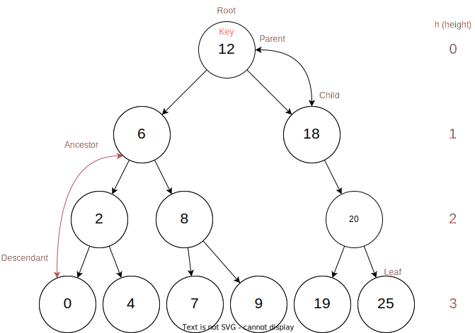
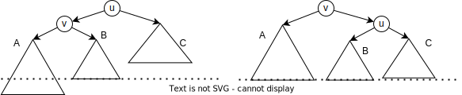
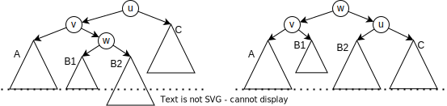

# Datastructures

## Abstract data type (vs. data structures)

Abstract data types define what we want to do with some data. The following chapter describe a series of 
abstract data types (ADT) and discuss possible implementations. In general, the objects as well as their operations 
are described.

## List

A list is defined as an ADT containing objects/keys in a set order and defines (among others) the following operations:

- `insert(K,L)`: insert an object `K` at the end of list `L`
- `get(i,L)`: get the object at index `i` from the list `L`
- `delete(o,L)`: delete the object `o` from list `L`
- `insertAfter(o, K,L)`: insert object `K` after `o` in list `L`

The following **data structures** are possible implementations of the _list_ ADT.

- **Array**: requires the maximum length to be known.
- **Linked list**: each list entry is an object containing the key and referencing the following object in the list.
  The list object is a reference to the first element in the list.
- **Doubly linked list**: similar to the linked list, but each object references the following AND preceding object,
  and the list object has a reference to the first and last element in the list.

|                    | `insert` | `get`  | `delete` | `insertAfter` |
|--------------------|----------|--------|----------|---------------|
| array              | $O(1)$   | $O(1)$ | $O(n)$   | $O(n)$        |
| linked list        | $O(n)$   | $O(n)$ | $O(n)$   | $O(1)$*       |
| doubly linked list | $O(1)$   | $O(n)$ | $O(1)$*  | $O(1)$*       |

*operations require the memory location of the object to be known. 

## Dictionary

The dictionary is a collection of unique keys - each key can be found at most one time in the collection. Important 
operations are: 

- `search(x, W)`: is `x` in `W`?
- `insert(x, W)`: insert `x` into `W`, do nothing if it's already in there
- `delete(x, W)`: remove `x` from `W`

This ADT can be implemented using some type of list. However, such dictionaries are not very efficient as most 
operations would run in $O(n)$. We are looking for something more efficient, namely $O(log(n))$. This is possible 
using binary trees (with the additional AVL condition) described in the chapter below. It is possible to have more 
efficient data structures, but these are probabilistic, and were not discussed in this course. 

### Binary/Search Tree

A binary tree is a structure where every node links to (at most) two child nodes. At the top we have the root node that
has no parent node. Each binary tree has a **search-tree condition** that defines how the child keys compare to the 
parent key. A typical condition is: all node's keys in the left subtree are smaller than the parent node's key, and all
node's keys in the right subtree are greater. 

<figure markdown>

</figure>

We are talking about a _complete_ binary tree, if all levels are completely filled (except for the last level).

The _search_ and _insert_ operations are trivial: _search_ goes through the tree height once. By using the 
search-tree condition, the algorithm always knows in which subtree to continue searching. _insert_ is quite similar, 
as it is just using the _search_ algorithm. If the key does not yet exist, a new leaf is created where _search_ 
ended up. 

The _delete_ operation is somewhat more complicated, as the tree might have to be restructured. We make a case 
distinction. The element `x` is to be deleted. 

1. `x` is a leaf: trivial, just remove the node from its parent
2. `x` has only one child: trivial, x's child becomes its parent's child. 
3. `x` has two children: x must be replaced with the next-biggest element of the tree. This element can be found by 
   going into the right subtree of x, and then following the left subtrees until no left subtree exists. This 
   element becomes the new x. Now, the delete operation can be used on the element replacing x. 

Such a binary tree has, however, a problem in some cases. If a sorted array is converted into a binary tree, the 
tree depth will be equal to the array length - all operations are inefficient. We require thus a slightly modified 
search-tree condition.

### AVL Tree

The AVL tree is built on a binary search-tree but with an additional **AVL-condition**: the height of the left and 
right subtree must have a difference of at most 1. This must be valid for every node in the tree. In case the 
condition is no longer met, the tree must be restructured. This condition leads to trees where the number of nodes 
is equal to $\text{Fib}(h + 2) -1$ where $h$ is the tree's height. 

After the operations _insert_ and _delete_, the tree might have to be **rebalanced**. All predecessors of the 
affected node must be checked (in some cases, the check must not be followed all the way up to the root). In case 
the AVL-condition of some node `u` is no longer met, the following operation is to be done: 

In this case the left subtree of `u` has grown too large. As the left subtree of `v` has grown, a single rotation has 
to be carried out, as shown in the below picture. 

<figure markdown>

</figure>

Again the left subtree of `u` has become too large. But this time, the right subtree of `v` has grown. A double rotation
as shown in the following picture is to be done. 

<figure markdown>

</figure>

## Stack

The stack is a **LIFO** (last in first out) data structure, storing object in the order they were added to the
structure. This ADT describes the following operations:

- `push(x, S)`: add the element `x` to the top of the stack `S`
- `pop(S)`: remove and return the top element of `S`

This data can be implemented using a linked list.

## Queue

The queue is a **FIFO** (first in first out) data structure, storing object in the order they were added. It is thus
quite similar to the stack, but the order of object retrieval is different.

- `enqueue(x, Q)`: add the element `x` to the end of the queue `Q`
- `dequeue(Q)`: remove and return the first element in the queue

- This data can be implemented using a doubly linked list.

## (Max)-Heap

The ADT Max-Heap has a clever way to sort its data allowing access to the maximum element in constant time.
It is for example used in the sorting algorithm _HeapSort_ and consists of the two main operations: 

- `insert(x, H)`: insert the value `x` into the heap
- `extractMax(H)`: remove and return the maximum value from the heap

A possible implementation uses a binary tree with a **Heap condition** that specifies how the tree must be 
constructed to be valid: it specifies that the key of an element must be greater or equal to all keys of its 
descendants.

### In-memory representation

The heap is stored as an array. The indexes can be used to determine an element's position in the binary tree underlying
the heap: the direct children of the element $i$ are to be found at index $2i$ and $2i + 1$ (requires indexing to start
at $1$).

### Operations

Both operations shown below always require the heap-condition to be met before the operation is started. As the tree has
a depth of $log(n)$, and the elements are only moved vertically, a maximum of $log(n)$ swaps can be done in both cases.
It follows, that their time complexity is $O(log(n))$.

**Insert**

1. Put element at the end of binary tree (in memory: the end of the array)
2. Compare the element with its parent. If the parent is smaller, swap the keys.
3. Repeat step 2 until heap-condition is met.

**ExtractMax**

1. Get the heap's maximum from the root.
2. Replace the root's key with the key of the last leaf in the binary tree.
3. Swap the new root with the biggest of its two children.
4. Repeat step 3 until both children are smaller or equal to itself in which case the heap-condition is met again.

**CreateHeap** is another possible operation. It can be done by using the _Insert_ operation on all elements of the
array. Another possibility is to reuse the given array and use it as the heap. At the beginning, the heap-condition is
(most certainly) not met. Next, we start looking at the last complete level of the binary tree and let all keys _sink_.
This means, the elements are compared to its children, and if necessary, swapped with the bigger of the two. This is
then repeated for all levels up to the root of the heap, resulting in a heap meeting its heap-condition. The _sinking_
process must be done all the way to the bottom of the tree.
