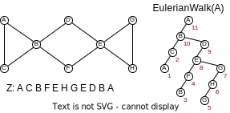
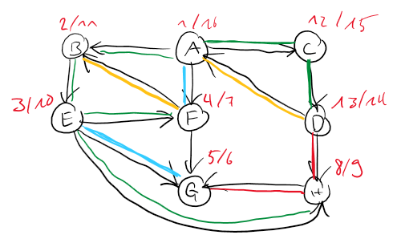
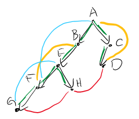
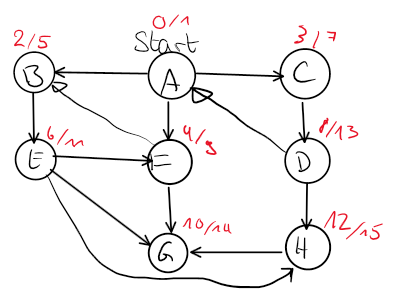
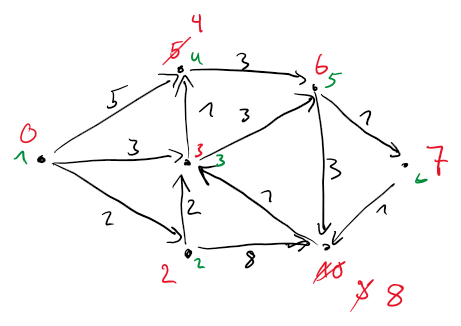
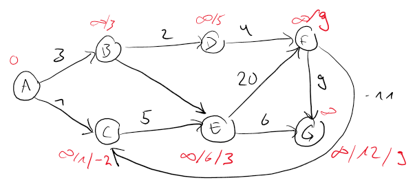

# Graph theory

A graph $G$ is a set of vertices $V$ and edges $E$ where an edge is defined as an _unordered pair_ of vertices $e = uv$
with $u \neq v$. Directed graphs are quite similar, but edges are defined as _ordered pairs_.

## Definitions

**Vertices**:

- **Vertex degree $\text{deg}(u)$**: Number of adjacent vertices. In a directed graph, this is further split into
  $\text{deg}_{in}$ (number of outgoing edges) and \text{deg}_{out} (incoming edges)
- **Source (Quelle)**: Vertex with $\text{deg}_{in} = 0$
- **Sink (Senke)**: Vertex with $\text{deg}_{out} = 0$ (exists, if the graph is acyclic)
- **Leaf**: Vertex with $\text{deg}(u) = 1$
- **Adjacent (Adjazent, benachbart)**: two vertices directly connected through an edge
- **Incident (Inzident, angliegen)**: edges connected to a vertex
- **$u$ reaches $v$**: There exists a path from $u$ to $v$
- **Strongly connected** (in directed graphs): both edges $uv$ and $vu$ exist

**Graphs**:

- **Complete graph**: all vertices are pairwise adjacent
- **Transitive graph**: for any two edges $uv$ and $vw$, the edge $uw$ also exists
- **Connected component (Zusammenhangskomponente ZHK)**: biggest possible subgraph where there exists a walk between
  every pair of vertices.
- **Connected graph (zusammenhängend)**: Graph with exactly one connected component
- **Tree**: connected graph without cycles. A tree with $n$ vertices has $n-1$ edges
- **Multi-graph**: edges are allowed to be duplicated

**Walks**:

- **Walk (Weg)**: sequence of adjacent vertices with two endpoints where the length is defined as the number of
  vertices on the walk
- **Closed Walk (Zyklus)**: walk with identical first and last vertex
- **Path (Pfad)**: walk without repeating vertex
- **Cycle (Kreis)**: path with identical first and last vertex

**Special walks**:

- **Eulerian walk**: walk using every edge exactly once. Exists if at most two vertices have an odd degree.
- **Eulerian closed walk**: closed walk using every edge exactly once. Exists if all edges have an even degree, and
  only one ZHK exists.
- **Hamiltonian path**: path visiting every vertex exactly once. A graph with a Hamiltonian path also has an
  Eulerian walk.
- **Hamiltonian cycle**: cycle visiting every vertex exactly once.

### Finding Eulerian walk

We define the algorithm `Walk(u)` that finds a walk in a graph with starting vertex $u$ where each edge is used at
most once, and all edges incident to the final node were used.

```
Walk(u):
    if u has adjacent vertex v, and edge uv is not marked:
        mark uv
        Walk(v)
```

This algorithm has the **invariant**: number of unmarked edges incident to $v$ is odd. If the invariant is valid
before the execution of $Walk(v)$, it is also valid afterward. Actually, if it is valid before the execution, the
algorithm will find a _closed walk_.

By slightly modifying this algorithm, we are able to use it to find an Eulerian walk. We put every vertex into a global
list `z` after it has been fully processed (has no more unmarked incident edges). The marking is also global.

```
EulerianWalk(u):
    for every adjacent vertex v of u, with uv not marked:
        mark uv
        EulerianWalk(v)
    z <- (z, u)
```

By executing the above algorithm on any node in the graph, we can find an Eulerian cycle in $z$ **IFF** the graph is
connected, and all vertex degrees are even. See the following example.



### Storing a graph in memory

An **adjacency matrix** stores the edges in a square matrix of size $|V|^2$. Due to its size, it is often considered
inefficient, as most of the cells will be empty (set to $0$), except if $|E| \geq \Omega(|V|^2)$.

The **adjacency list** is a list of vertices, where for each vertex a linked list of nodes is stored. This linked
list represents all the adjacent vertices.

The improved **adjacency list** stores some additional data: for each vertex, we know the vertex degree, and
identical edges in the adjacency list are linked together.

## Topological order

The topological order is a special order of the vertices of a directed acyclic graph (DAG, a directed graph without
cycles). Such an order is not necessarily unique.

### Search algorithms

To find a topological order, we follow the steps below:

1. Find a sink $v$
2. $v$ is the last element in the topological order
3. Remove $v$ and call this algorithm recursively

To find a sink in the graph, we use the following algorithm on an arbitrary vertex. The last vertex in the path is a
sink.

```
Path(u):
    mark u
    if u has unmarked descendant:
        Path(u)
```

### Depth first search (DFS)

To find a complete topological order of a graph, we can use a so-called **depth first search**. The algorithm is
called on any vertex of the graph, giving us a **pre-** and **post-numper**. It is called depth first, because the
algorithm first explores a final vertex in the path and then goes up one level to continue searching.

```
DFS(G):
    for unmarked v:
        Visit(v)
        
Visit(u):
    pre[u] <- T;  T++
    for unmarked descendant v of u:
        Visit(v)
    post[u] <- T; T++
```

If this algorithm is called on the root of the topological order, this results in a DFS-tree, otherwise in a
DFS-forest. The reverse post-order results in the topological order (if we have a DAG).

In the following example, the algorithm is executed on a graph with cycles. In red, we have the pre- and post-number.

<figure markdown>

</figure>

The pre- and post-number of a vertex $u$ creates the interval $I_u$

The edges are colored as follows:

- Green: **tree edge** - edge building up the DFS-tree
- Yellow: **backward edge** - remaining edges $uv$ where $I_v$ completely contains $I_u$
- Blue: **forward edge** - remaining edges $uv$ where $I_u$ completely contains $I_v$
- Red: **cross edge**: - remaining edges $uv$ where $I_u$ is entirely in front of $I_v$

This allows us to build a **recursion tree/DFS-tree**:

<figure markdown>

</figure>

If a graph has a backward edge, it follows that the graph has a cycle. And thus no topological order exists.

DFS can also be executed on undirected graphs, with the following properties:

- forward edge = backward edge
- cross edges do not exist.

## Shortest path

In graphs, we are searching for shortest paths between two vertices. This must always be a path, as visiting a
vertex twice would unnecessarily add more edges to cross. Each edge is weighted, and these weights can also be
negative.

- Path cost (Wegkosten) $c(W)$: sum of the edge weights
- Distance $d(u,v) = \text{min}\{c(W) \mid \text{W is walk from } u \text{ to } v\}$
- $d(u,v) \leq d(u, w) + d(w,v)

Once the shortest paths towards all vertices was found, the **shortest-path-tree** can be constructed, spanning up a
tree where a path from the starting vertex to all other vertices exists.

The following chapters will look at five algorithms that can be used in different use cases to find shortest paths.

=== "1-to-all"

    | Edge costs           | Algorith         | Running time          |
    |----------------------|------------------|-----------------------|
    | $c(e)=1$             | BFS              | $O(m+n)$              |
    | $c(e)\geq 0$         | Dijkstra         | $O((m+n) log(n))$[^1] |
    | $c(e) \in \mathbb{R}$ | Bellman-Ford[^2] | $O(m \cdot n)$       |

=== "all-to-all"

    | Edge costs           | Algorith                    | Running time                  |
    |----------------------|-----------------------------|-------------------------------|
    | $c(e)=1$             | $n \times$ BFS              | $O((m+n) \cdot n)$            |
    | $c(e)\geq 0$         | $n \times$ Dijkstra         | $O((m+n) log(n) \cdot n)$[^1] |
    | $c(e) \in \mathbb{R}$ | $n \times$ Bellman-Ford[^2] | $O(m \cdot n^2)$             |
    | $c(e) \in \mathbb{R}$ | Floyd-Warhsall              | $O(n^3)$                     |
    | $c(e) \in \mathbb{R}$ | Johnson                     | $O(n (m + n) log(n))$        |

[^1]: Using a priority queue (e.g. MinHeap)
[^2]: Requires the graph to have no negative cycles

### Breadth first search (BFS)

The breadth first search algorithm can be used to find the shortest path in an unweighted graph, where only the
number of crossed vertices are counted. It is called breadth first, as each vertex is fully processed, before going
a level further. This is achieved using a queue. Actually, this algorithm not only computes the distance between two
vertices, but between a starting vertex and all other connected vertices.

```
BFS(s):
    queue = {s}
    dist[s] = 0
    enter[s] = 0
    T = 1
    
    while !queue.empty:
        u = queue.deq()
        leave[u] = T; T++
        for (u,v) in E && enter[v] empty:
            queue.enq(v)
            dist[v] = dist[u] + 1
            enter[v] = T; T++
```

The algorithm keeps track on what steps a vertex is started to being processed, and when it is finished.
Additionally, it computes the distances to each vertex, and adds adjacent vertices to the list of vertices to process.
Executed on the vertex A in the graph below, the shown enter and leave numbers result.

<figure markdown>

</figure>

### Dijkstra (non-negative edges)

To find the shortest paths in graphs without negative weighted edges, the Dijkstra algorithm can be applied. In
general, this algorithm sorts the vertices by distance to the starting vertex $s$. We use the following recurrent:

$$
d(s, v_k) = \text{min}_{v_i \to v_k} \{d(s, v_i) + c(v_i,v_k)\}
$$

The algorithm keeps track of upper bounds distances to the starting vertex, until all vertices were processed at
which point we have the shortest path distances in the array $d$.

```
Dijkstra(s):
    d[s] = 0 
    for v in V && v != s: d[v] = infinity
    priorityQ = {(s, 0)}
    S = {}
    
    while S != V:
        v = priorityQ.enq()
        S.add(v)
        for w in v.adjacent() && w notin S:
            if d[v] + c(w,v) <= d[w]:
                d[w] = d[v] + c(w,v)
                priorityQ.enq(w, d[w])
```

In the following figure, the algorithm is run on a given graph. In red, we see the evolution of the costs, and in
green the order of processing.

<figure markdown>

</figure>

### Bellman-Ford (negative edges)

The Bellman-Ford algorithm finds shortest paths in a graph without negative cycles. The principle of this algorithm
is to have $l$-precise bounds - bounds that are only exact for the first $l$ vertices in the shortest-path-tree. These
bounds are iteratively improved, until the costs do no longer change, which is after $(n-1)$ runs at the latest. The
recurrence of this algorithm is defined as:

\begin{align}
\forall v &\in S_{\leq l} \; \backslash \; \{s\}\\
d(s,v) &= min\{d(s,u) + c(u,v) \mid u \to v,\; u \in S_{\leq l-1}\}
\end{align}

```
BellmanFord(s):
    d[s] = 0 
    for v in V && v != s: d[v] = infinity
    
    while d changed:
        for v in V:
            for u in v.adj():
                d[u] = min(d[u], d[v] + c(v, u) 
```

This algorithm can be seen in below graph where the red values show how the costs evolve.


<figure markdown>

</figure>

| A | B        | C        | D        | E        | F        | G        |
|---|----------|----------|----------|----------|----------|----------|
| 0 | $\infty$ | $\infty$ | $\infty$ | $\infty$ | $\infty$ | $\infty$ |
| 0 | 3        | 1        | 5        | 6        | 9        | 12       |
| 0 | 3        | -2       | 5        | 3        | 9        | 9        |

#### Finding negative cycles

As soon as an algorithm has negative cycles, there is the potential to have negative cycles. To find if such a cycle
exists, we simply execute the Bellman-Ford algorithm. If a negative cycle exists, the algorithm will never terminate
as the weights become smaller in each iteration.

### Floyd-Warshall

### Johnson

## Minimum spanning tree (MST)

A Spanning tree is a connected subgraph with minimum weights. To find such a tree we can look for the minimum edge
incident to each vertex and add it to the MST. This, however, most certainly leaves us with a forest instead of a
tree - we now have a series of connected components. To connect the forest into a single tree, we repeatedly add the
minimum weight edge on each ZHK to the MST.

While the MST results in the minimum graph weight, it should not be confused with an alternative to find the 
shortest paths. 

### Uniqueness

In graphs with unique weights, the MST is **always** unique.

### Algorithms

The following chapters describe three algorithms that search for the MST.

| Algorithm | Running tim               |
|-----------|---------------------------|
| Boruvka   | $O((n + m) \cdot log(n))$ |
| Prim      | $O((n + m) \cdot log(n))$ |

#### Boruvka

This first algorithm was already described in the introduction to the MSTs. The following pseudocode describes it 
in more details. In the first iteration, every vertex is its own ZHK. One iteration of the loop has a duration of $O
(n+m)$, and it is executed $log(n)$-times, as after each iteration, the number of ZHKs is halved.

```
Boruvka(V,E)
    F = {} // edge set of the spanning-tree
    while F not spanning-tree:
        S1,...,Sk = ZHK(V, F)
        e1,...,ek = minEdges(V,E)
    
        F.append(e1,...,ek)
```

#### Prim

Prim's algorithm is quite similar but here we look at one vertex after the other. Some starting vertex represents 
the first ZHK, which is getting extended after each iteration until the spanning-tree is complete. In each iteration,
the minimum weighted edge incident to the ZHK is added.

```
Prim(V,E,s):
    prioQ = queue(V, infinity)
    S = {}
    d[s] = 0
    for v in V && v != s: d[v] = infinity
    
    prioQ.decrease_key(s, 0)
    while prioQ.notempty():
        v = prioQ.deq()
        S.append(v)
        
        for w in v.adj():
            if !S.contains(w):
                d[v] = min(d[v], c(v,w))
                decrease_key(v, d[v])
```

#### Kruskal

## Layered graphs