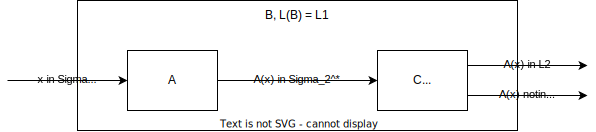

# Complexity

Problems are divided into different complexity classes. The most used complexity types are time-complexity and
space-complexity. These complexity classes can also help to stop infinite calculations: if we know the complexity of a
certain problem, but the algorithm runs longer than expected on working out the solution, the calculation can be
stopped, and we know that no solution exists.

The _time-complexity_ of a turing-machine is defined as the complexity of the longest calculation on some input with
length $n$. More formally: $\text{Time}_M(n) = max \{\text{Time}_M(x) \mid x \in \Sigma^n\}$.

To compute the _memory-complexity_ of a k-tape turing-machine $M$, we define multiple instances of the space function.
Let $C$ be a configuration of the TM, and $\alpha_i$ the content of tape $i$. The memory-complexity is defined as

\begin{align}
\text{Space}_M(C) &= max\{|\alpha_i| \mid i = 1, ..., k\}\\
\text{Space}_M(x) &= max\{\text{Space}_M(C_i) \mid i = 1,...,l\}\\
\text{Space}_M(n) &= max\{\text{Space}_M(x) \mid x \in \Sigma^n\}
\end{align}

## Complexity classes

Problems are generally separated into problems that are solvable using a deterministic TM, and solvable using a non-
deterministic TM.

The most important classes are:

- **P**: the class of practically decidable problems. A problem is practically solvable if a polynomial algorithm
  exists.
- **NP**: the class of practically decidable problems with the use of a non-deterministic turing-machine.

### Deterministic classes

We now look at a couple of classes for deterministic problems.

\begin{align}
TIME(f) &= \{L(B) \mid B \text{ is an MTM with Time}_B(n) \in O(f(n))\}\\
SPACE(g) &= \{L(A) \mid A \text{ is an MTM with Space}_B(n) \in O(g(n))\}\\
DLOG &= SPACE(log_2n)\\
P &= \bigcup_{c \in \mathbb{N}}TIME(n^c)\\
PSPACE &= \bigcup_{c \in \mathbb{N}}SPACE(n^c)\\
EXPTIME &= \bigcup_{n \in \mathbb{N}}TIME(n^{n^d})
\end{align}

To continue, we are talking about constructable functions:

- **Platzkonstruierbar**: $s: \mathbb{N} \to \mathbb{N}$. A function called _platzkonstruierbar_ is, if there exists
  a single-tape turing-machine $M$ such that $\text{Space}_M(n) \leq s(n)$ for all $n \in \mathbb{N}$ and generates
  for any input $0^n, n \in \mathbb{N}$ the word $0^{s(n)}$ on its working-tape, and stops on its accepting state.
- **Zeitkonstruierbar**: $t: \mathbb{N} \to \mathbb{N}$. A function is called _zeitkonstruierbar_ if there exists a
  multi-tape turing-machine $M$ such that $\text{Time}_A(n) \in O(t(n))$ and for every input $0^n, n \in \mathbb{N}$,
  the word $0^{t(n)}$ is generated on its working-tape, and $M$ stops on its accepting state.

We can define the following relations between above classes:

- $TIME(t(n)) \subseteq SPACE(t(n))$: every TM working in time $n$ cannot write on more than $n$ cells on the tapes,
  as the TM can move its head by only one cell on every instruction. Thus: $P \subseteq PSPACE$
- $SPACE(s(n) \subseteq \bigcup_{c\in \mathbb{N}} TIME(c^{s(n)})$. The TM cannot run longer than it takes to check every
  possible configuration. Otherwise, there is a duplicate configuration, and the TM runs indefinitely (the function $s$
  must be platzkonstruierbar). Thus: $DLOG \subseteq P$, $PSPACE \subseteq EXPTIME$.

From above relations, we can find the following fundamental hierarchy of deterministic complexity classes:

$$
DLOG \subseteq P \subseteq PSPACE \subseteq EXPTIME
$$

### Non-deterministic classes

The non-deterministic classes contain problems that can be solved using a non-deterministic turing-machine. The NTM is
capable of choosing the "best" input, meaning, it chooses the input leading to the correct result that is most
efficient.

In such a computation, the time-complexity for a TM $M$ on an input $x$ ($\text{Time}_M(x)) is defined as the shortest
path to an accepting state (inside an NTM tree of states). For some input of length $n$, this generalizes to

$\text{Time}_M(n) = max\{\text{Time}_M(x) \mid x \in L(M) \cap \Sigma^n\}

The space-complexity is related to the time complexity, as it is defined as the longest configuration in above described
computation.

We define the following complexity classes

\begin{align}
NTIME(f) &= \{L(B) \mid B \text{ is an N-MTM with Time}_B(n) \in O(f(n))\}\\
NSPACE(g) &= \{L(A) \mid A \text{ is an N-MTM with Space}_B(n) \in O(g(n))\}\\
NLOG &= NSPACE(log_2n)\\
NP &= \bigcup_{c \in \mathbb{N}}NTIME(n^c)\\
NPSPACE &= \bigcup_{c \in \mathbb{N}}NSPACE(n^c)\\
\end{align}

We can put those classes into relations, that are valid for all functions $t$ and $s$ with $s(n) \geq log_2n$:

- $NTIME(t) \subseteq NSPACE(t)$
- $NSPACE(s) \subseteq \bigcup_{c \in \mathbb{N}}(c^{s(n)})$

Further, we can also put those functions in relation with the deterministic complexity classes:

- $TIME(t) \subseteq NTIME(t)$
- $SPACE(t) \subseteq NSPACE(t)$
- $NTIME(s(n)) \subseteq SPACE(s(n)) \subseteq \bigcup_{c \in \mathbb{N}} TIME(c^{s(n)})$

### NP-hard and NP-complete

The two classes NP-hard and NP-complete define sets of problems.

- A language $L$ is called **NP-hard** if any language $L' \in NP$ can be reduced to $L$: $L' \leq L$.
- A language $L$ is called **NP-complete** if it is NP-hard, and $L \in NP$.

If some NP-hard language $L$ is in $P$, then $P=NP$, meaning that all practically solvable problems using a non-
deterministic turing-machine are also practically solvable using a deterministic turing-machine. Our current 
understanding is, however, that $P \neq NP$. 

## Problems

The first problem we look at called $SAT$ (satisfiability) is **NP-complete**, thus all other problems can be reduced to
a SAT problem in polynomial time. A KNF is defined by variables $x_i$ and their literals $x_i,\overline{x_i}$. These
literals create a set of clauses, where the literals are combined in a disjunction $\lor$. These clauses are then
combined in a conjunction $\land$. See the following example of a KNF:

$$
\Phi = (x_1 \lor x_2) \land (x_1 \lor \overline{x_2} \lor \overline{x_3}) \land (\overline{x_1} \lor x_3) \land (
\overline{x_2})
$$

The SAT problem tries to find out if the KNF has an input that evaluates the output to true. One input can be checked
in polynomial time, as the KNF can simply be evaluated. However, finding one that evaluates to true, requires a non-
deterministic TM to have result in polynomial time. It is simple to create a tree containing all possible input
configurations (each variable evaluating to 0 or 1).

$$
SAT = \{ x \in \Sigma_{logic}^* \mid x \text{ encodes a satisfiable KNF} \}
$$

A special case of the $SAT$ problem is the $3SAT$ problem, where each clause in the KNF can only contain three literals.
The input KNF can be recoded to a conjunction of multiple KNF with three literals. See the following transformation.

\begin{align}
\Phi &= (x_1 \lor \overline{x_2} \lor x_5 \lor \overline{x_7} \lor x_4 \lor \overline{x_6})\\
\Phi' &= (x_1 \lor \overline{x_2} \lor y_1) \land (\overline{y_1} \lor x_5 \lor y_2) \land
(\overline{y_2} \lor \overline{x_7} \lor y_3) \land (\overline{y_3} \lor x_4 \lor \overline{x_6})
\end{align}

The $CLIQUE$ problem is defined on a graph. We search for sub-graphs of size $k$ (or $y$ depending on how the input is
defined) that is completely connected.

$$
CLIQUE = \{ x\#y \mid x,y \in \Sigma_{bool}^*, x \text{ encodes a graph } G_x \text{ containing a y-clique} \}
$$

The $IND-SET$ problem is somewhat the opposite of above problem. It looks for sub-graphs in $G$ of size $k$, where
all vertices are pairwise not connected.

$$
IND-SET = \{(G,k) \mid G \text{ has } k\text{-independent-sets} \}
$$

The last problem we looked at during the lectures is the _vertex-cover_ problem, where we search for a set of $k$
vertices, such that every edge of the graph is connected to one of the selected vertices.

$$
VC = \{ (G,k) \mid G \text{ has a vertex-cover of size } k\}
$$

### P-reduction

We have seen earlier, that a subset of problems from NP called NP-complete is at least as hard as all other problems in
NP. If any of these problems turns out to be in P, all other NP problems can be solved in polynomial time. This is
because we can create a P-reduction that _translate_ one problem into a different problem. It is similar to an EE-
reduction, but the TM transforming the input **must run in polynomial time**.

A reduction helps us find out the complexity of a problem. If $L_1 \leq_P L_2$, and $L_1$ is NP-hard, $L_2$ is NP-hard
as well. More formally, we define the reduction as follows.

Let $L_1 \subseteq \Sigma_1^*$ and $L_2 \subseteq \Sigma_2^*$, where $L_1$ can be reduced on $L_2$ in polynomial time:
$L_1 \leq_P L_2$ if $\exists$ a polynomial TM $A$, computing $\forall x \in \Sigma_1^*$ a word $A(x) \in \Sigma_2^*$
such that $x \in L_1 \Leftrightarrow A(x) \in L_2$.

<figure markdown>

</figure>

To illustrate this, let's have a couple of examples.

$SAT \leq_P CLIQUE$: The TM $A$ converts the KNF into a graph problem, where each literal becomes a vertex. Vertices of
one clause are logically regrouped into groups $F$. The edges are constructed as follows: each literal is connected to
all other vertices outside its group $F$ except for the negated literal ($x_i$ has no edge towards $\overline{x_i}$).
This graph can now be passed to a TM $B$ with $L(B) = CLIQUE$, and $k$ is set to the number of clauses. If the KNF is
satisfiable, the graph will contain a clique of size $k$. We have thus converted a problem $SAT(\Phi)$ to
$CLIQUE(G,k)$

$CLIQUE \leq_P IND-SET$: The TM $A$ simply takes the input graph $G$ and converts it to $G^C$, which means that existing
edges are removed, and replaced with the set of all possible edges between vertices that were not present in $G$. The
value of $k$ is kept the same. If the original graph contained a clique of size $k$, the graph complement now contains
$k$ pairwise independent vertices (as before the complement, they were fully connected). We have thus converted a
problem $CLIQUE(G,k)$ to $IND-SET(G^C,k)$.

$CLIQUE \leq_P VC$: The TM $A$ again computes the graph complement $G^C. However, $k'$ is set to $|V| - k$. The 
complement of a graph having a clique of size $k$ thus has a vertex cover of $|V| - k$. 

!!! info "Proof template"

    We want to show $L_1 \leq_P L_2$.

    To show this, we build a TM $A$ running in polynomial time that converts a problem instance of $L_1$ into an 
    instsance of $L_2$. 

    _[insert the work of the TM here, typically somthing in the form of what was shown in above examples]_

    This TM obviously runs in polynomial time. _[short description why that is]_

    Proof for $\Rightarrow$: Suppose we have an input $(...) \in L_1$. _[show why $A(...) \in L_2$. if deemed necessary,
    also show proof for an input $(...) \notin L_1 \Rightarrow A(...) \notin L_2$]_

    Proof for $\Leftarrow$: Suppose we have an input $(...) \in L_2$. _[identical to above proof]_