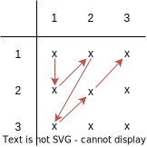
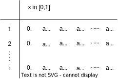
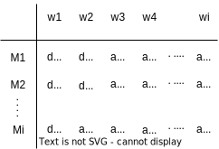
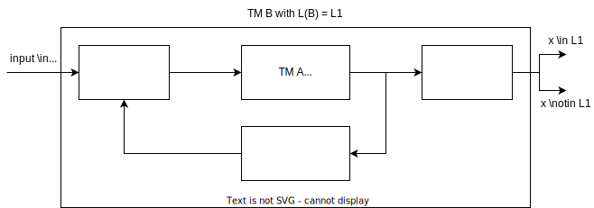
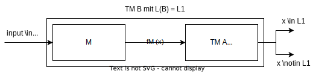

# Computability

Computability is one of the first theories described in computer science. It is used to classify problems into 
algorithmically solvable and non-solvable problems. 

## Infinities

At first, we must realize that there are different types of infinity. For example, there are more languages than 
there are turing-machines: $|KodTM| < |Pot(\Sigma^*)|. We know however, that an infinite amount of TMs and an infinite
amount of words in the power product exist. Let's start with the following definition. We have the sets $A$ and $B$.

- $|A| \leq |B|$, if an injective function $f: A \to B$ exists.
- $|A| = |B|$, if $|A| \leq |B|$ and $|B| \leq |A|$ (thus a bijective function exists).
- $|A| < |B|$, if $|A| \leq |B|$ and no injective function $f: B \to A$ exists.

We can make a first observation with the two sets $|\mathbb{N}| = |\mathbb{N}_{even}|$. One would think that the first
set would be bigger, as the second only contains every second number. However, by the above definitions, we find that
they are equivalent as the bijective function $f(i)=2i$ exists. 

A set is defined as **countable** if $|A|$ is finite, or if $|A| = |\mathbb{N}|$.

### Hilbert Hotel

The hilbert hotel is an intuition to compare finite sets. We assume an infinite hotel where the rooms are enumerated 
as $1,2,...$. Now, a new guest arrives and we want to find a room for this guest. We tell all the current guests that 
they should move into the room next to theirs ($i \to i+1$). Room 1 gets empty, and the new guest can move into this 
room. 

Now, if a bus with an infinite amount of guests arrives, we can now tell all the guests in to the room with double 
the room number of their current room ($i \to 2i$). 

### Examples of infinities

We have seen  that $\mathbb{N}$ is countable. We can also show that $(\mathbb{N} - \{0\}) \times (\mathbb{N} - \{0\})$
is countable as well. We do this by setting up a matrix where the rows and the columns contain the two sets that are
multiplied. We then define a canonical order according to the red arrows. With this order, we can enumerate all values
present in said set. 

<figure markdown>

</figure>

The same way we can also show that $\mathbb{Q}$ is countable. The rows contain the enumerators, and the columns the
dividers. 

### Diagonalisation

A set that is not countable is the real numbers in the interval $[0,1] = \{x \in \mathbb{R} \mid 0 \leq x \leq x\}$. To
prove this, we first define the following table where we enumerate real numbers in said interval. 

<figure markdown>

</figure>

We define a new entry to the set $C$ as $C=0.C_1C_2C_3...$ with $C_i \neq a_{ii}, c_i \notin \{0,9\}$ for all $i$. 
The new entry, however, is not part of the table as it differs on the diagonal $a_{ii}$ from all other entries (as 
we defined that $C_i \neq a_{ii}$).

Similarly, we define a new table that combines $w_i \in \Sigma^*_{bool}$ and $M \in KodTM$. $d_ij = 1$ if $M_i$ 
accepts the word $w_j$.   

<figure markdown>

</figure>

We now construct the diagonal language denoted as $L_{diag}$ is not in $\mathcal{L}_{RE}$ (the set of recursive 
languages). The constructed language does not yet exist in the set $L(M_i)$.

$$
L_{diag} = \{w \in (\Sigma_{bool})^* \mid w = w_i \; for \; some \; i \in \mathbb{N} - \{0\} \; and \; d_{ii} = 0\}
$$

## Reduction

Reductions allow us to compare different languages regarding their difficulty. Using the reduction we can say that a 
certain language is at least as or at most as difficult as some other language. We have discussed two types of 
reduction: **EE** (Eingabe zu Eingabe) and **R** (recursive) reduction. These reductions are related:

$$
L_1 \leq_{EE} L_2 \Rightarrow L_1 \leq_R L_2
$$

### R-Reduction

The less strong reduction of the two takes and input and moves it through a first turing-machine transforming the input
on the alphabet from the first language $x \in \sum_1^*$. This input is then given to a turing-machine $A$ that decides
on $L_2$. The output can then either be given to another TM doing some transformation and giving it back to the first
TM (recursion), or give it to an (optional) output TM that then outputs the final answer $x \in L_1$ or $x \notin L_1$. 

The complete turing-machine processes the language $L_1$ by internally using a turing-machine processing the language
$L_2$.

<figure markdown>

</figure>

### EE-Reduction

An EE-reduction is similar to an R-reduction, but is more restrictive. The output of the TM $A$ must not be processed, 
the output of $A$ must be the output of $B$. In this reduction, we are only allowed to modify the input given to $B$ 
before giving it to the TM $A$

<figure markdown>

</figure>

## Languages and their properties

In general, we talk about two groups of languages. They define the behaviour of turing-machines that detect the 
respective language.

- **Recursive**: The turing-machine will halt on any input either and can thus always decide if a certain input is in
  the language or not.
- **Recursive enumerable**: The turing-machine is not guaranteed to halt. It will detect all inputs that are part of 
  the language. But the TM might run indefinitely on inputs that do not belong to the language.

Regarding these language classes, we can also say: $L \in L_{RE}, L^C \in L_{RE} \Leftrightarrow L \in L_R$. 

$L_U \in L_{\mathcal{R}}$, $L_U \in L_{\mathcal{RE}}$

$$
L_U
$$

$$
L_H
$$

## The "Post'sche Korrespondenzproblem" (PKP)