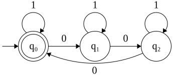
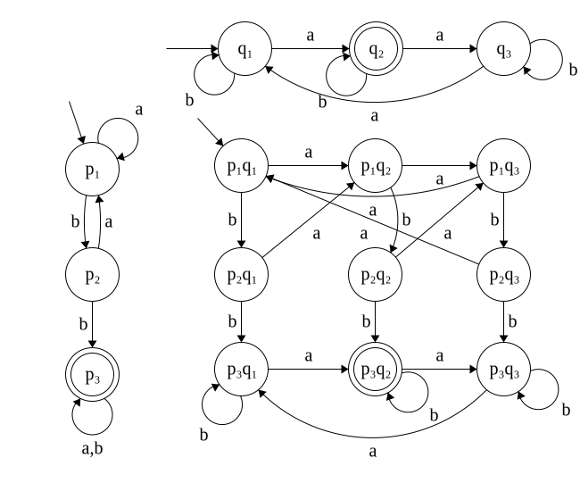
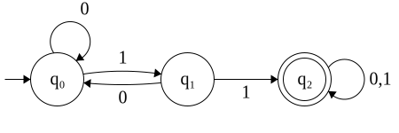
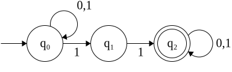
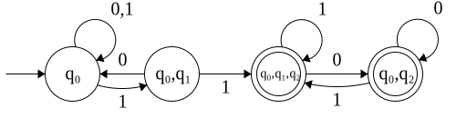

# Finite-State machines

A finite-state machine (Endlicher Automat EA) is a state-machine capable of identifying words of a specific regular
language. Before getting started, we again need some notions.

An EA is defined as a five-tuple $M=(Q,\Sigma,q_0,F,\delta)$.

- $Q$: finite set of states
- $\Sigma$: input alphabet (symbols that are processed by the EA)
- $q_0 \in Q$: starting state
- $F \subseteq Q$: set of accepting states
- $\delta: Q \times \Sigma \to Q$: the set of all possible state-transitions. The set essentially describes what state
  the machine will land in for every possible state combined with every possible symbol of the alphabet.
  $\delta(q_i,aw)$ outputs the state after the machine, which is currently in $q_i$, read the symbol $a$. The function
  $\hat{\delta}$ is quite similar but outputs the state after reading the entire word
- $Kl[q_i]$: class of the state $q_i$, describing the form of the words landing in said state

The following additional terms are important.

- **Configuration**: everything that is important for the future - $(q, aw) \in Q \times \Sigma^*$ denoting the current
  state and the remaining input.
- **Start-configuration**: $(q_0, w) \in \{q_0\} \times \Sigma^*$ denoting the starting state and the full input.
- **End-configuration**: every configuration $\in Q \times \{\lambda\}$, the configuration after having read the full
  input.
- **Step**: expresses the relation $|_{\!\overline{\;M\;}}$ between two configuration such as
  $(q,w) |_{\!\overline{\;M\;}} (p,x)$ with $w \in \Sigma^*$, $w = ax$, $\delta(q,a)=p$.
- **Computation C**: describes a sequence $C = C_0,C_1,...,C_n$ of configurations such that $C_i |_{\!\overline{\;M\;}}
  C_{i+1}$. If $C_0$ is the start configuration and $C_n$ the end configuration, $C$ is the computation of $M$ on input
  $x$.
  $C$ can be accepting or rejecting, depending on the final state $q_n$. If $q_n \in F$, $C$ is accepting.

Now, let's see a couple of above definition using an example state machine. The following EA accepts the language
$L=\{w\in\Sigma_{bool}^* \big|\, |w|_0 \: mod\: 3 = 0\}$.

<figure markdown>

</figure>

$$
\begin{align*}
M &= \big(Q,\Sigma,q_0,F,\delta\big)\\
Q &= \{q_0,q_1,q_2\}\\
\Sigma &= \{0,1\}\\
q_0 &= q_0\\
F &= \{q_0\}
\end{align*}
$$

The following table describes the $\delta$ function.

| $\delta$ | 0     | 1     |
|----------|-------|-------|
| $q_0$    | $q_1$ | $q_0$ |
| $q_1$    | $q_2$ | $q_1$ |
| $q_2$    | $q_0$ | $q_2$ |

Now, assume we have input $x=01101$, the following computation is made.

$$
(q_0,01101) \; |_{\!\overline{\;M\;}} \; (q_1,1101) \; |_{\!\overline{\;M\;}} \; (q_1,101) \;
|_{\!\overline{\;M\;}} \; (q_1,01) \; |_{\!\overline{\;M\;}} \; (q_2,1) \; |_{\!\overline{\;M\;}} \; (q_2,\lambda)
$$

This is equivalent to $\hat{\delta}(q_0,x)=q_2$

The classes of above EA can be written as one generalized description with $i\in\{0,1,2\}$:

$$
Kl[q_i] = \big\{w \in \Sigma^* \big| \, |w|_0 \; mod \; 3 = i \big\}
$$

## Modularity

Big state machines for more complicated languages can be expressed as a cartesian product of multiple smaller
state-machines. In below picture, we see three machines with the following definitions:

$$
\begin{align*}
L_{top} &= \{|w|_a \; mod \; 3 = 1\}\\
L_{left} &= \{ubbv \; \mid \; u,v \in \{a,b\}\}\\
L_{comb} &= \{|w|_a \; mod \; 3 = 1\ \land ubbv \; \mid \; u,v \in \{a,b\} \}
\end{align*}
$$

<figure markdown>

</figure>

The formal definition of the above machine:

$$
\begin{align*}
M &= \{Q, \Sigma, \delta, q_0, F\}\\
Q &= Q_{top} \times Q_{left}\\
q_0 &= (p_0, q_0)\\
\delta &= (\delta_{top}(q,a),\delta_{left}(p,a))\\
F &= L(M_{top}) \cap L(M_{left})
\end{align*}
$$

## Proof of non-existence of a shorter machine

To prove the non-existence of a smaller machine, we first start by constructing a possible suspected shortest
machine. For each state, we then provide a word with which the machine will land in that state after having processed
the word.

Then, all the provided words must be compared pairwise, and for all pairs, a suffix must be found with which one of
the words will be part of the langauge while the other won't.

Let's look at an example. Below machine is suspected to be the shortest possible machine detecting the language
$L = \{w \in \{0,1\}^* \; \mid \; a11b, \; with \; a,b \in \{a,b\}^* \in \}$

<figure markdown>

</figure>

We start by constructing three words that land in a different state. See the words $\lambda,1,11$. Now, the following
table compares the words pairwise and provides a suffix $z$ that brings only one of the words into the language.

| $z$       | $\lambda$ | 1         | 11        |
|-----------|-----------|-----------|-----------|
| $\lambda$ | -         | 1         | $\lambda$ |
| 1         | 1         | -         | $\lambda$ |
| 11        | $\lambda$ | $\lambda$ | -         |

## Proof of non-regularity

Some languages are non-regular. This means that no finite-state machine exists that detects said language. We now
discuss three approaches to prove a non-regularity.

### Lemma 3.3

In case that two words $x,y$ with $x \neq y$ land in the same state when being processed by an FSM $A$
($\hat{\delta}(q_o,x) = \hat{\delta}(q_o,y))$, the following statement is true: $xz \in L(A) \Leftrightarrow yz \in L
(A)$. We observe that the machine does not store the past of the word - it always only looks at the current and the
future state.

We then construct an infinite set of words $x_1,x_2,...$ such that $x_iz \in L$ but
$x_jz \notin L$.

We first constructed an infinite set of words. By definition, there cannot exist a machine that can distinguish all
of those words, and there must therefore exist two words (here $x_i$ and $x_j$) which will arrive in the same state.
This, however, was disproven by above statement.

Let's look for example at the language $L = \{0^{n^2} \; \mid \; n \in \mathbb{N}\}$. We construct the following
infinite
set of words:

- $0$
- $0^4$
- $...$
- $0^{n_i^2} \cdot 0^{2i+1} = 0^{(n_i+1)^2} \in L$
- $0^{n_j^2} \cdot 0^{2i+1} = 0^{(n_i+1)^2} \notin L$

### Pumping Lemma

To prove the non-regularity through the pumping lemma, we search for **one specific split** of a $w \in L$ with
$|w| \geq n_0$: $w =yxz$. We are free to choose any arbitrary word $w$, but the split must be generalised through below
properties.

For a regular language, this split must have the following properties:

- $|yx| \leq n_0$
- $|x| \geq 1$
- Either all $yx^kz (k\in \mathbb{N})$ are in $L$ or none.

Let's look for example at the language $L = \{w \in \{a,b,c\}^* \; \mid \; |w|_{ab} = |w|_{ba}\}$. We define our word
$w = (abc)^{n_0}(bac)^{n_0} \in L$. Due to above properties, we know that $x$ must be in the first part of the word,
and we
can prove the non-regularity by looking at the following two cases:

- Case $x=c$: $yx^0z = ...abcababc...$, we now have an additional $ba$ in the word, and thus $yx^0z \notin L$.
- Case $x\neq c$: $x$ contains at least one $a$ or $b$. $yx^0z$ is thus missing at least one $ab$.

Now, because the original word $w$ is in the language $L$ and for any possible split the word will not be in $L$, we
have contradiction to the three properties defined above.

### Kolmogorov-Complexity

The non-regularity proof through Kolmogorov-Complexity uses a contradiction. With the information received from the
course, we only consider languages over the binary alphabet. It would be possible to extend the proof on other
alphabets, but we have not proven this possibility in the course.

We first assume that a given language $L$ is regular. We construct a second language $L' = \{y \in \{0,1\}
^* \mid xy \in L\}$. Then, we look at a word $z$ (not necessarily in $L$), which is defined with some $n \in \mathbb
{N}$. $z$ is considered to be the $m$-th word in $L'$ (is constant for one proof, but can change for different proofs).

If we can show that $z$ is always the $m$-th word in $L'$, we can conclude that $z$ is not depending on $n$ but on the
language $L$. The Kolmogorov-Complexity can, in this case, be written as a constant: $K(z) \leq \lceil log_2(m+1) \rceil
+c=c'$.

As there are only infinitely many programs of said constant length, but there are infinitely many words in $L$, we
have a contradiction and thus $L$ cannot be regular.

Let's have an example. We want to prove that the language $L_1 = \{0^{F_n} \mid n \in \mathbb{N}\}$ where $F_n$ is the
$n$-th fibonacci number is not regular. $F_0 = 0, F_1 = 1, F_{n+1} = F_n + F_{n-1}$ for $n\geq 1$.

We first assume that $L_1$ is regular (as we will prove the non-regularity by contradiction). We consider the word
$z = 0^{F_{n+1}-F_n-1}$, which can be simplified to $z = 0^{F_{n-1}-1}, n \geq 2, n \in \mathbb{N}$. Now, we claim that
z is the first word in canonical order in the following language:

$$
L' = \{y \in \{0,1\}^* \mid 0^{F_n+1}y \in L_1\}
$$

We find this first word as $0^{F_n+1}z = 0^{F_n+1}0^{F_{n+1}-F_n-1}=F^F_{n+1} \in L_1$. There is no shorter word
possible, as we know that the fibonacci sequence is growing monotonically. This shows us that $c$ depends on $L_1$, but
not on $n$ and we arrive at the following formula.

$$
K(z)=K(0^F_{n-1}-1) \leq \lceil log_2(1+1) \rceil c = 1 + c
$$

We arrive at the conclusion that the Kolmogorov constant is $1 + c$. This is telling us that only a finite amount of
programs egxists. However, as there are infinitely many words $z$, we have a contradiction.

## Non-deterministic finite-state machine

The Non-deterministic finite-state machines (NEA) are quite similar to the EAs, but with the difference that it can be
in multiple states at once; a state can have multiple outgoing transitions for the same symbol. Its formal definition
is almost identical: $M = (Q, \Sigma, \delta, q_0, F)$ where $\delta$ has the new definition $\delta: Q \times
\Sigma \to Pot(Q)$.

If, after having processed the entire word, at least one final state is an accepting state, the word is in the
language. Actually, the sole difference between the NEA and the EA is that some languages have simpler representations
as NEAs. Everything else is identical as all NEAs can be converted to an EA.

Let's convert the following NEA into an EA.

<figure markdown>

</figure>

We first start constructing a transition table. In the first row we see that there are two possible states after having
read the symbol **1**. We construct thus a new state that consists of the two possible states, and, in a next step, look
at the possible transitions from those states.

| **Q**             | **0**         | **1**             |
|-------------------|---------------|-------------------|
| $q_0$             | $q_0$         | $\{q_0,q_1\}$     |
| $\{q_0,q_1\}$     | $q_0$         | $\{q_0,q_1,q_2\}$ |
| $\{q_0,q_1,q_2\}$ | $\{q_0,q_2\}$ | $\{q_0,q_1,q_2\}$ |
| $\{q_0,q_2\}$     | $\{q_0,q_2\}$ | $\{q_0,q_1,q_2\}$ |

Once all states in the second and third column have been added to the column **Q**, we can start constructing the EA,
which looks as follows. Notice that all states containing the accepting state $q_2$ are accepting states in the EA.

<figure markdown>

</figure>
