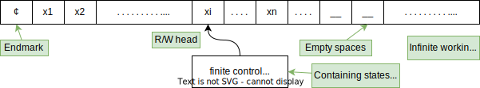
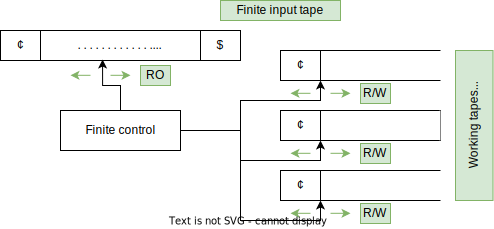

# Turing-machine

The turing-machine (TM) is a concept of a machine that can detect (almost) all languages. The 
**Church-Turing-Thesis** states that **TM**s are suitable formalisations of the term *"Algorithm"*.

It is based on an infinite work tape (which can be seen as an infinite amount of storage) and a finite control (or
unformally a "program"). The following diagram describes a turing-machine with all its basic components.

<figure markdown>

</figure>

## Definitions

The formal definition of a TM is a seven-tuple $M=(Q, \Sigma, \Gamma, \delta, q_0, q_{accept}, q_{reject})$ with the
following symbol definitions.

- $Q$: finite state set
- $\Sigma$: input alphabet
- $\Gamma$: working alphabet, $\Sigma \in \Gamma, (¢, \_\_) \in \Gamma - \Sigma, \Gamma \cap Q = \emptyset$
- $\delta$: $Q- \{q_{acc}, q_{rej}\} \times \Gamma \to Q \times \Gamma \times \{L,R,N\}$ where $L,R,N$ are the movements
  that the R/W-head is able to do (move left 1, move right 1, neutral)
- $q_0$: start state
- $q_{accept}$: accepting state, also $q_{acc}$
- $q_{reject}$: rejecting state, also $q_{rej}$

### Processing definitions

A **configuration** is an element from $Konf(M)=\{¢\}\cdot \Gamma^* \cdot Q \cdot \Gamma^+ \cup Q\{¢\}\Gamma^+$.
$\Gamma^*$ describes the tape content to the left of the R/W-head, $Q$ the current head position, and $\Gamma^+$
everything to the right of the head. The second element of the union describes the special case when the head is on
the end mark (where the head should not be able to go further to the left).

The **start configuration** for some input $x$ is $q_0¢x = Q_0$. Further configurations can then be denoted as
$¢q_1qaw_2$, where $q$ is the head position, and $a$ is the symbol at said position.

Let's consider a **step** where the head is currently on $x_i$and will replace said symbol with $y$. There are three
possible steps to be taken. Here, we transition from one config $Q_j$ to the next configuration $Q_{j+1}$:

- No movement: $¢x_1x_2...x_{i-1}qx_ix_{i+1} \; |_{\!\overline{\;M\;}} \; ¢x_1x_2...x_{i-1}pyx_{i+1}$ which is identical
  to $\delta(q,x_i)=(p,y,N)$
- Movement left: $¢x_1x_2...x_{i-1}qx_ix_{i+1} \; |_{\!\overline{\;M\;}} \; ¢x_1x_2...x_{i-2}px_{i-1}yx_{i+1}$ which is
  identical to $\delta(q,x_i)=(p,y,L)$
- Movement right:$¢x_1x_2...x_{i-1}qx_ix_{i+1} \; |_{\!\overline{\;M\;}} \; ¢x_1x_2...x_{i-1}ypx_{i+1}$ which is
  identical to $\delta(q,x_i)=(p,y,R)$

A **computation** is a sequence of configurations $Q_1,Q_2,...$ with $Q_i \; |_{\!\overline{\;M\;}} \; Q_{i+1}$. A TM
can **run indefinitely**, or **stop** on $w_1qw_2$ with $q \in \{q_{acc},q_{rej}\}$. The TM can then be
**accepting** if it stops on the accepted state, or **rejecting** if it stops on a rejecting state or if it is running
indefinitely.

The **accepted language** is denoted as $L(M) = \{w \in \Sigma^* \mid q_0 \notin w\; |_{\!\overline{\;M\;}}^* \; w_1
q_{acc}w_2, \: w1,w2 \in \Gamma^*\}$. A language is **recursively enumerable** (rekursiv aufzählbar, ($\mathcal{L}_
{RE}$)) if M is able to tell if a word $x$ is in the language, but might run indefinitely if $l \notin L$. If M can 
also always tell if $x \notin L$, the language is said to be **recursively (decidable)** ($\mathcal{L}_{R}$).

### TM example

Let's look at the following example. We have seen previously that the language $L = \{0^{2^n} \mid n \geq 1\}$ is not
regular. With a turing-machine, we are able to detect the language. The following process is a possible solution.

- Mark every second $0$
- Repeat the above step until only a single $0$ remains.
- The word is part of $L$ in case above condition applies.

## Multi-tape turing-machine

The multi-tape turing-machine (MTM) is similar to the TM, but possesses a constant (but arbitrary) number of tapes. One
of those tapes is a read-only input tape, while the others are working tapes that are empty at the beginning. See the
following visualisation of an MTM.

<figure markdown>

</figure>

The **start configuration** consists of three parts:

- $¢w\$$ on input tape for an input $w$. The read-head is on $¢$.
- Empty working tapes, where the R/W-heads are on $¢$
- Starting state $q_0$

The configuration itself is denoted as $(q,w,i,u_1,i_1,...,u_k,i_k)$ with the following definitions:

- $q$: current state
- $w$: input
- $i$: head-position on input
- $u_k$: content of working band $k$
- $i_k$: R/W-head-position on working band $k$

The **transition-function** is now defined as:

$$
\delta: Q \times (\Sigma \cup \{¢,\$\}) \times \Gamma^k \to Q \times \{L,R,N\} \times (\Gamma \times \{L,R,N\})^k
$$

### MTM vs TM

Actually, an MTM is not more powerful than a TM, because we can show that for all MTM, an equivalent TM exists. The TM
will be way more complicated, and for one step in an MTM, a series of steps are usually required in a TM. The sole tape
of the TM must additionally contain the stored words as well as the position of the heads.

A machine $A$ (MTM) is equivalent to a machine $B$ (TM), if for all $x \in \Sigma^*$ all the following conditions
apply.

- $A$ accepts $x \Leftrightarrow B$ accepts $x$
- $A$ rejects $x \Leftrightarrow B$ rejects $x$
- $A$ runs indefinitely on $x \Leftrightarrow B$ runs indefinitely on $x$

If above apply, we can say that **$A$ and $B$ are equivalent $\Rightarrow L(A) = L(B)$**. However, the other way around
**$A$ and $B$ are equivalent $\Leftarrow L(A) = L(B)$** does not apply!

## Non-deterministic turing-machine

The non-deterministic turing-machine (NTM) is an extension to the TM. It's formally defined as the seven-tuple
$M = (Q,\Sigma,\Gamma,\delta,q_0,q_{acc},q_{rej})$ where $\delta$ has been redefined as 
$\delta: (Q-\{q_{acc},q_{rej}\}) \times \Gamma \to Pot(Q \times \Gamma \times \{L,R,N\})$. Additionally, delta must make 
sure that the tapes are not left. 

The non-determinism is similar to the one described for the finite-state machines; it is possible for the NTM to 
transition into multiple states on the same input, head position and current state. 

Let M be a NTM, and $x \in \Sigma^*$. The NTM can be described as a computational tree $T_{M,x}$ with a root such that: 

- (i): Nodes are labeled with configurations
- (ii): root as the input degree 0, labeled with the starting configuration $q_0¢x$
- (iii): nodes with label C has children which are all possible following configurations of C.

Analog to the EA, it is also possible to express every NTM as a TM. 

## Turing-machine encoding

All turing-machines can be encoded as binary strings. The following is an arbitrary definition that was seen in the 
lectures. Other encodings are possible. 

$$
\begin{align*}
M&=(Q,\Sigma,\Gamma,\delta,q_o,q_{acc},q_{rej})\\
Q&=\{q_0,q_1,...,q_{acc},q_{rej}\} \;\; \Gamma = \{A_1,...,A_m\}\\
Code(q_1) &= 10^{i+1}1, \; Code(q_{acc})=10^{m+2}1, \; Code(q_{rej})=10^{m+3}1\\
Code(A_j) &= 110^j11\\
Code(N)&=1110111, \; Code(R)=11100111, \; Code(L) = 111000111\\
Code(\delta(p,A)=(q,A_n,d))&=\#Code(p)Code(A)Code(q)Code(A_n)Code(d)\#\\
Code(M) &= \#0^{m+3}\#0^\Gamma\#\#Code(Transition1)\#Code(Transition2)\#...
\end{align*}
$$

We observe that the above encoding is not a binary encoding as the alphabet used is $\{0,1,\#\}$. We therefore 
define the function **h** converting the ternary encoding into a binary encoding and is defined as follows.

$$
\begin{align*}
h&: \; \{0,1,\#\}^* \to \{0,1\}^*\\
Kod(M) &= h(Code(M))
\end{align*}
$$