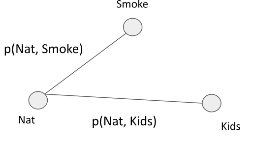

# Privacy

With the rize of AI in the recent years, a new problem came apparent. If one does not pay attention on how models are
created, they might be leaking training data. This training data is often very personal and should not be available
to anyone using the model. This chapter focuses on techniques for improving a model's privacy.

## Privacy attacks

### Model stealing

Models are expensive to train, are trained with large datasets that might also be expensive to create. A provider
wants to sell access permissions to the model. The question to be asked: is it possible to steal the model through
the provided access?

**White-box**: A malicious client could for example buy a model. Of course the provider would prohibit the client from
reselling it. But by fine tuning the model, he can then resell it as it is often almost impossible to prove that the
model
is being used without permission.

**Black-box**: A malicious client could use the model not at it was intended by the provider. If done correctly, the
client can steal the provider's competitive advantage.

### Model inversion and data extraction

In model inversion, the attacker queries the model to find some representative training input. Say for example we have
a facial recognition model that outputs based on an image, a person's name. Malicious clients could search for images
that
classify to the same name. This image is a representative image for the given name.

Data extraction is even worse, as the attacker finds an exact data point from the training set. This is especially
dangerous if the training data is private. Especially large neural networks are prone to such issues, as they tent to
memorize some training samples. Preventing the memorization hurts the accuracy.

### Membership inference

In this attack, the attacker uses the model to infer if a known datapoint is part of the training set. Supposing that we
know the rough data distribution, the attacker can train shadow models - some with and some without said data point.
Then,
a classifier is trained on the outputs of the shadow models. This classifier tries to guess if the datapoint is or is
not
part of the dataset. The real model output can then be put through this classifier.

## Federated learning

(Model inversion/data extraction)

In federated learning, we try to train a model on data comming from third parties clients that do not want to share
their data.
Insetad, the clients shair a **training update** without sending the data itself. These updates are collected on a
central
server and result in a global model. Even though the data never leaves the client, the updates still contain information
regarding the data. A malicious server might be able to reconstruct the data based on the update.

### FedSGD

In FedSGD, each client $k$ computes a gradient update $g_k$ based on a minibatch of their data $\mathcal{D}_k$ and sends
$g_k$ to the server. This guarantees convergence to some local minima but takes many communication rounds to converge.

This technique has multiple attack vectors:

- **Poisoning**: a client sends bad updates, degrading the global model
- **Non-cooperative**: the client usess the model but does not share updates
- **Gradient inversion**: the server sends weights that expose information in the client update
- **Closed-form reconstruction**: it is possible to reconstruct the exact input from the gradient (batch size 1, and
  linear NN)

The latter is also approximately possibel for bigger batch sizes using the following formula. In essence, the server is
somewhat
curious and tries to reconstruct the data that was used to compute the gradient update. He does this through a random
initialization, and then finding data that leads to the closest gradient updates.

$$
\text{argmin}_{x^*} \; d(\nabla_\Theta\mathcal{L}(f_\Theta(x^*), y^*), g_k) + \alpha_{reg} \cdot \mathcal{R}(x^*)
$$

Where $d$ computes the distance between the reconstructed gradient and the true gradient, and $\mathcal{R}$ the
domain-specific knowledge (what do we know about the data we try to uncover).

Such attacks are fairly straight forward on images (continuous data), but are also possible on tabular data by using
one-hot encodings on categorical features. The difficulty then lies in distinguishing good and bad reconstructions. To
get
some notion of reconstruction quality, a possibility is to have a series of random initializations, and create
normalized
histograms for each tabular cell. By measuring the **entropy** of the histograms, we can see if our reconstruction was
probably correct. Low entropy means that the reconstruction is good.

### FedAvg (federated averaging)

A more common setup includes an averaging process on the server. The client computes its weights over multiple epochs.
The server then averages the weight updates over all clients. The client could even add some randomness that should be
canceled out in the global model. This method has the advantage of reducing the number of require communication rounds.

The question now is if the weight updates do preserve privacy. The challenge for the attacker is that he is unable to
observe the intermediate weights, and only gets the final update. Even the order of how data points are fed to the
network change the outputs.

A possible attack simulates the process and uses differentiation. The simulation produces intermediate weights based on
some guessed input samples. The
distance between the final simulated weight and the weight update is then fed to automatic differentiation which is
used to optiize the reconstruction of the data points.

An **Order-invariant prior** is used to enforce that the set of reconstructed images in different epochs are identical.
This is done by adding a weak prior $\mathcal{R}$ that averages the input per epoch across epochs.

$$
\text{argmin}_{\tilde{x}^k} d(\tilde{\Theta}^k, \Theta^k) + \alpha_{reg} \cdot \frac{1}{E^2}\sum_{e_1,e_2}
\mathcal{R}(g(\{\tilde{x}^k_{e1,b}\}), g(\{\tilde{x}^k_{e_2,b}\}))
$$

In above formula we compute the distance between the simulated weights $\tilde{\Theta}^k$ and the true weights
$\Theta^k$ for some client $k$. The prior computes the average distance between the average images at every pair
of epochs $e_1$ and $e_2$ with $E$ numer of epochs.

## Differential privacy

In differential privacy we try to protect models against **Membership inference**. A mechanism $M$ is called
$\varepsilon$
differential private if the following holds:

$$
Pr[M(a) \in S] \leq e^\varepsilon Pr[M(a') \in S]
$$

$\varepsilon$ defines how far appart those two mechanisms are. Here, we are saying that for all neighboring datasets
$a,a'$ and an attack $S$, the attacker is equally likely to succede in the attack regardless which datasets is in use.
A neighboring dataset is defined as (adding/removing one person) or (changing features of one person).

Laplacian noise with mean 0 can be added: $f(a) + Lap(0, \Delta_1/\varepsilon)$ is $\varepsilon$-DP, where $\Delta_1$ is
the sensitifity (largest possible effect of changing input on output in L1 norm.

Adding gaussian noise $f(a)+ \mathcal{N}(0 \sigma^2I)$ leads to ($\varepsilon, \delta$)-DP. $\sigma$ is defined as

$$
\sigma = \frac{\sqrt{2log(1.25)/\delta} \cdot \Delta_2}{\varepsilon}
$$

with $\Delta_2$ the effect of changing the input as an L2 norm. We add a small $\delta$ to counter cases where the
probability is tiny.

$$
Pr[M(a) \in S] \leq e^\varepsilon Pr[M(a') \in S] + \delta
$$

A common pattern to applying such mechanism is splitting an algorithm into two parts, that are now executed in sequence.
Between the two sub-algorithms, we then add noise.

### Benefits

- We make no assumtions on attackers
- Post-processing: a mechanism that is ($\varepsilon, \delta$)-DP, is also ($\varepsilon, \delta$)-DP if it is
  post-processesd
- Composition: given two ($\varepsilon, \delta$)-DP mechanisms, the combination adds up to ($\varepsilon_1 +
  \varepsilon_2,
  \delta_1 + \delta_2$)-DP.

### Applications

**DP-SGD**: Noise is introduced in training. This makes it impossible to retrieve data from the model, and one can
publish it
without a problem. If noise is added durring inference, we might run into issues where the model is queried many times.
In this
case, the data might get leaked as the noise averages out. This technique adds the noise to the gradient. The amount of
noise
added is defined as

$$
\sigma = \frac{\sqrt{2log(1.25)/\delta} \cdot (C/L)}{\varepsilon}
$$

with $L$ the batch size, and $C$ the maximum sensitivity of the gradient.

- One iteration without subsampling: ($\varepsilon, \delta$)-DP.
- One iteration with subsampling of size q: ($\tilde{q}\varepsilon, q\delta$)-DP
- $T$ iterations with subsampling of size q: ($\tilde{q}T\varepsilon, qT\delta$)-DP

The latter is bad, because we lose a lot of privacy. In this case we would have to add more noise, which in turn reduces
the
accuracy of a model.

**PATE**: In PATE, the data is split into $m$ partitions. Each partition is given to a separate **teacher model** for
training.
These teacher models are then used in a noisy voting process on an **aggregate teacher** model. This model predicts the
labels on
some public unlabeled data. This new dataset is then used to create a **student model**, which has thus no more
connection to the
original data.

The voting process works as follows. Let $n_j(x)$ be the number of teachers predicting $j$ on some input $x$. The
aggregating
function $f$ is defined as

$$
f(x) = arg\max_j\{n_j(x) + Lap(0, 2/\varepsilon)\}
$$

One such query is ($\varepsilon, 0$)-DP. For $T$ queries, this degrades to ($T\varepsilon, 0$)-DP.

When compared with DP-SGD, PATE can be used on any algorithm, and achieves better results ($2.04, 10^{-5}$-DP for 98%
accuracy
on MNIST, compared to ($8,10^{-5})-DP with 97% accuracy).

**FedSGD**: each client clips the gradient, and adds some gaussian noise to its computed gradient.

**FedAVG**: each client clips its final weights, and then adds some gaussian noise before sending them to the server.

## Synthetic data

Private sensitive data sets cannot be shared with the public due to privacy regulations. However, in some case this
might still be interesting: e.g. a hospital would like to share data to research groups. In such cases, a new data set
can be generated that contains only synthetic data and has provable differential privacy guarantees.

The key challenge here is to generate data having similar statistical properties to the original data but preserving
privacy.

### Select-Measure-Generate

We define a three-step procedure for generating synthetic data:

1. **Select**: we define _marginal queries_ we want to measure. The output data should have similar properties according
   to these queries. They can be 1-way or 2-way.
2. **Measure**: we measure the marginal queries using differential privacy by adding some noise (as seen in differential
   privacy).
3. **Generate**: we generate the data

A **Marginal** is defined on a subset of attributes $C \subseteq \mathcal{A}$. For each of these attributes, we compute
how many entries have some specific value for this attribute. E.g. the 1-way marginal for an attribute _nationality_
counts how many entries in the original dataset have a specific nationality. In SQL, this could be compared to a
`GROUP BY 'Nationality'` with the aggregation function `COUNT`.

2-Way marginals are quite similar, but they also cover relationship between two marginals. This can be compared with a
`GROUP BY` on two columns.

Each such marginal has a **sensitivity** of $1$, because adding one entry will only change a single entry in the output.

The attribute selection can be done automatically by generating a graph based on the data. Each variable defines a
vertex, and the weight of the edges connecting these vertices is defined by the mutual dependency $I(X,Y)$. The
**Chow-Liu algorithm** then computes the maximum spanning tree of this graph.

$$
I(X,Y) = \sum_x \sum_y \frac{p(X=x,Y=y)}{p(X=x)p(Y=y)}
$$

Let's say the following graph results from above step.

<figure markdown>

</figure>

We can now generate data based on the following probabilities. This is called **belief propagation**.

\begin{align}
&p(\text{Nat}=N, \text{Smoke}=S, \text{Kids}=K) \\
= &p(\text{Nat}=N) p(\text{Smoke}=S | \text{Nat}=N)p(\text{Kids}=K|\text{Nat}=N)
\end{align}

!!! danger "Privacy"

    Using the above approach, we have a generation process. However, the generated data is not yet private. The marginal 
    selection must be differential private, and the measurement require some level of noise.

During the selection process, the MST must be estimated in a differentially private manner. This is done by using
**exponential mechanism**(1) to estimate the maximum weight edge between two connected components. In the measure phase,
we simply add some gaussian noise. The probability for the exponential mechanism can be computed as follows, with 
$\Delta$ the sensitivity. 
{ .annotate}

1. The _exponential mechanism_ allows us to select the "best" element from a set while preserving differential privacy.
   Based on the score given to each entry, (here the output of the function $I$), the algorithm computes probabilities
   for each item, and then selects one at random based on these probabilities.
   
$$
\exp(\frac{\epsilon \cdot I(X,Y)}{2 \cdot \Delta})
$$
