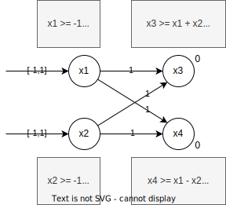
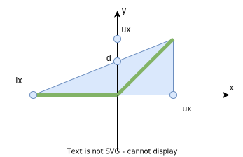
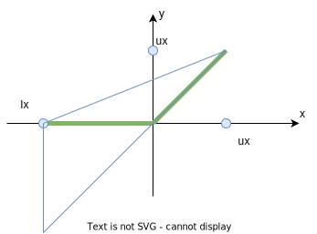
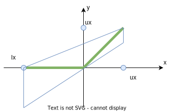
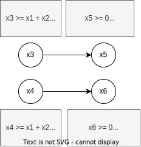
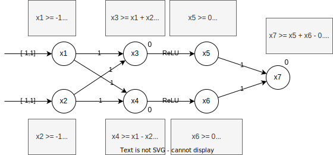

# Robustness

AIs have typically issues where they make false classifications due modified inputs. Such modifications can happen on
data directly, or on the data that is being captured. All in all, it gets more and more important to have AIs that
have a certain level of certified robustness giving some securities to the user. This is especially important for
security-relevant applications.

However, it is generally hard to certify models. And often, certification and improved robustness come with a certain
cost regarding the model's performance, especially if those certifications are required to be scalable.

## Attacks

AI models have generally weaknesses and can be fooled by attackers. Adding a small amount of noise to an image can
for example lead an image recognition model to wrong conclusions, or adding tape at certain spots on a stop sign can
lead models to recognise it as a different sign.

### Adversarial attacks

In adversarial attacks, we generally view two types of attacks:

- **Targeted Attack** where the attacker aims to classify the input as a **specific label** which differs from the
  correct label.
- **Untargeted Attack** where the aim is to classify the input as some label that is not the correct one.

The attacks can be further split into **white box** attacks where the attacker knows the complete model including
parameters and the architecture, and **black box** attacks where the attacker only knows the architectures but has no
information about the parameters.

The following chapters only discuss white box attacks. Below table describes the three attacks in brief.

| Attack type                 | Region                                      | Optimization                                                   | Outcome                                                                            |
|-----------------------------|---------------------------------------------|----------------------------------------------------------------|------------------------------------------------------------------------------------|
| FGSM (targeted, untargeted) | $[-\epsilon, +\epsilon]$                    | One step of size $\epsilon$                                    | Output will be on region boundary                                                  |
| PGD (mostly untargeted)     | Any region for which projections exist      | Many steps, uses projections to stay inside the region         | Inside region with maximised loss                                                  |
| Carlini (targeted)          | Image and image + $\eta$ must be in $[0,1]$ | Produce change $\eta$ with small $l_\infty$, taking many steps | Image inside $[0,1]$ with (hopefully) small $_\infty$ distance from original image |

#### Fast Gradient Sign Method (FGSM)

This attack uses the gradient descent of the classification model. The loss function of the gradient descent is
computed, and the added/removed from the input to form a modified output that should be classified with some other
label. The loss function is, however, modified before being added/removed: only the sing of the values is looked at,
not the exact value. This lead to better results than taking the gradient itself.

First, the perturbation is computed. This is slightly different for the targeted (T) and untargeted (U) mode. In T, the
loss function is computed for the target label **3**, whereas in U, the original label **s** is used.

$$
\eta_{t/s} = \epsilon \cdot sign(\nabla_xloss_{t/s}(x))
$$

where $\epsilon$ a small value indicating how large the perturbation should be, and $sign(g)$ returning -1 if $g < 0$, 0
if $g = 0$, or 1 if $g > 0$. When applied to an image, $x_i$ is a pixel of the image.

As the output of the loss function is passed through the sign function, and then multiplied by $\epsilon$, the output is
guaranteed to stay in the range $x \pm \epsilon$. The original paper had a single iteration of this algorithm. If the
perturbation did not change the output, the next input was looked at. The algorithm is designed to be fast and simple.

- **Targeted**: $x' = x-\eta_t$ modifies the input by **minimising the loss** for the label $t$.
- **Untargeted**: $x' = x+\eta_s$ modifies the input by **maximising the loss** for the original label $s$.

#### Carlini attack

In this attack, we are trying to find a perturbation $\eta$ classifies an input $x \in X$ to a target label $t \in C$:
$f(x + \eta) = t$ where $||\eta||_p$ is minimized. We thus have an optimization problem. We also require that $x+\eta$
stays in the domain of the problem ($[0,1]$ for images).

The optimization problem has currently a **hard discrete constraint** ($f(x + \eta) = t$). However, it is hard to find
the gradient to such problems. We thus require a relaxation. The Carlini attack uses a relaxation through an objective
(proxy/soft) function $obj_t$ such that

$$
\mathsf{if} \; obj_t(x + \eta) \leq 0 \; \mathsf{then} (x + \eta) = t
$$

Using this function, we are now trying to minimize $$||\eta||_p + c \cdot obj_t(x + \eta)$. Notice that we are talking
about an **if** relation and not an **iff**.

The paper[^1] cites a series of soft functions. One highlighted in the course is

[^1]: [Carlini et al., Towards Evaluating the Robustness of Neural Networks](https://arxiv.org/abs/1608.04644)

$$
obj_t(x) = loss_t(x) -1 = -log_2(p_f(x)_t)-1
$$

where $p_f(x)_t$ is the probability of a class $t$ for some input $x$ on network $f$. The cross entropy loss is used as
a loss function. We now have a problem that can be optimized.

The model additionally has a **hard box constraint** to make sure that the output stays inside the domain of the input.
This is often solved through PGD (projected gradient descent).

Compare to the **FGSM**, this attack gets most often less perturbed attacks.

#### PGD

The **projected gradient descent** (PGD) can be seen as a series of FGSM attacks.

1. We start by picking some point $x_{orig}$ from the dataset and put an $l_\infty$ ball around it, with some $\epsilon$
   that is typically bigger than the one used in an FGSM attack.
2. Next, we select some random point $x$ in the box.
3. Now starts the PGD iteration. We compute $x' = x + \epsilon' \cdot sign(\nabla_xLoss(x))$. This is essentially an
   FGSM attack on $x$. $\epsilon'$ is smaller than $\epsilon$.
4. $x'$ might be outside the box around $x_{orig}$. We thus must project it back on the box $x'' = project(x',x_{orig},
   \epsilon)$. The projection uses clipping to get back into the box.
5. If $x''$ is not yet a labeled with a different class, we re-assign $x = x''$ and repeat from step 3 until we find
   another label.

Above algorithm is often run with a constant number of iterations. After that, either an adversarial example has been
found, or we simply look at the next sample $x$.

### Adversarial defenses

To defend somewhat against such attacks, we can use the following approach. For all samples $x$ we search for the point
in a region (eg. $l_\infty$) around $x$ that maximizes the loss. We then train the model on these points to minimize
the loss.

Although this might improve the adversarial accuracy, it typically reduces the standard accuracy.

An approach shown in the lecture (PGD-defense) uses a PGD-attack on a mini-batch of the dataset. The output of this
attack is then used in the training. The attack gives us samples with a maximized loss inside a region around the
original samples.

### Adversarial accuracy

The adversarial accuracy measures how well a model is holding against attacks in the $l_p$-ball for a specific
$\epsilon$. It is a metric for the robustness of a network.

Typically, a PGD attack is used to measure this metric. It takes all samples that were classified correctly, and tries
to break them. Let's say we have 100 samples out of which 95 are classified correctly (accuracy: 95%). Now, for 15
samples we found an adversarial example. The **adversarial accuracy** will thus be 80/100 = 80%.

## Certification

Until now, we have looked at attacks and defenses that might or might not work well in practice. However, there are no
formal guarantees. This is what we try to establish in this chapter: prove properties of realistic networks using
**automated verifiers**. More formally we can state our fundamental problem, given a neural network $N$, a property over
inputs $\phi$ (pre-conditions), and a property over outputs $\psi$ (post conditions):

**Prove that $\forall i \in I. \models \phi \Rightarrow N(i) \models \psi$ holds or return a violation**.

We can now instantiate this problem definition for an image classification neural network in the following steps.

1. **Define $\phi$**: to prove adversarial robustness, we define $\phi$ as the $l_\infty$-ball around an input $x$:
   $ball(x)_\epsilon = \{x' \in I \mid ||x-x'||_\infty < \epsilon \}.
2. **Verify $\psi$ satisfies $\phi$**. We define the property $\phi$ as: We want to prove that all inputs inside the
   ball around $x$ are classified identically to $x$.

The challenge of this approach is, that we cannot simply prove the property for all points in the $l_\infty$-ball as
there are too many of them. 

Before continuing, we must look at some properties of certification methods:

- **Sound vs. Unsound**
- **Complete vs. Incomplete**

### Certified defense

## Relaxation

### Box

### MILP

### DeepPoly

The relaxations seen in previous chapters are lossy, especially the box relaxation loses much precision on ReLU and
affine abstract transformers. DeepPoly improves on this by eliminating loss on affine transformers, and reducing loss on
ReLU transformers. 

Using the box relaxation we defined intervals of possible values for each neuron. For each following neuron, the 
intervals are combined leading to imprecise results. DeepPoly also works with intervals, but keeps in mind the relation
of the different neurons. Upon combining layers, we can apply back substitution of those relations which leads to 
simplifications in the relations and improve the respective precisions. 

Let's look for example at the following affine layers. For both x_1 and x_2, we have an input interval of $[-1;1]$. 
In addition of defining these intervals for each neuron of the first layer, we also compute the lower and upper bound
$l_1, u_1$. We do the same thing for the second layer but this time we define the intervals using the previous layer's 
neurons. The lower and upper bounds are computed through back propagation of above intervals. 

<figure markdown>

</figure>

For instance, nothing of interest has happened, our intervals are identical to the ones computed through the box 
relaxation. Let's look now at a DeepPoly relaxation for a **ReLU** function. We must consider three separate cases based
on the lower and upper bounds observed at the neuron's input. We consider the ReLU $x_j = max(0, x_i)$, where $x_j$ is 
our ReLU neuron and $x_i$ is the input.

- $l_i \geq 0$: strictly positive $a_j^\leq = a_j^\geq = x_i, l_j = l_i, u_j = u_i$
- $u_i \leq 0$: strictly negative $a_j^\leq = a_j^\geq = x_i, l_j = u_j = 0$
- $l_i < 0$ and $u_i > 0$: crossing ReLU, special relaxation applies

As illustrated in above case distinction, the relaxation is trivial for strictly negative and strictly positive 
input intervals. However, the crossing ReLU, where the interval includes both negative and positive values is more 
complicated. We discuss three possible relaxations.

!!! info "Relaxation constraints"

    === "Relaxation I"
        For the first relaxation we limit the values to the inside of below triangle. The triangle's sides are defined as
        follows: 
        
        - Lower $y$ bound: $y = 0$
        - Upper $y$ bound: $y = \gamma * (x - x_l)$ with a slope of $\gamma = \frac{u_x}{u_x - l_x}$
        - Right $x$ bound: $x = u_x$. 

        Note that the point $d$ is at 
        
        <figure markdown>
        
        </figure>
        
        Above line definitions can be translated into the following constraints: 
        
        - $y \geq 0$
        - $y \leq \gamma * (x - x_l)$
        - $x \leq x_u$

    === "Relaxation II"

        Let's get directly to the constraints. We keep the upper y limit identical to the previous relaxation. The lower
        bound is now defined as the slope of $x$.

        - Lower $y$ bound: $y \geq x$
        - Upper $y$ bound: $y \leq \gamma * (x - x_l)$ with a slope of $\gamma = \frac{u_x}{u_x - l_x}$
        - Lower $x$ bound: $x \geq l_x$ 

        <figure markdown>
        
        </figure>

    === "$\alpha$-relaxation"

        The $\alpha$-relaxation keeps some room for optimisation. The upper y limit is again identical. However, the 
        lower bound can be optimised through its slope to get the area of the shape as small as possible while staying
        inside the interval $\alpha = [0,1].

        - Lower $y$ bound: $y \geq \alpha x, \alpha \in [0,1]$
        - Upper $y$ bound: $y \leq \gamma * (x - x_l)$ with a slope of $\gamma = \frac{u_x}{u_x - l_x}$
        - Lower $x$ bound: $x \geq l_x$ 
        - Upper $x$ bound: $x \leq l_x$ 

        <figure markdown>
        
        </figure>

We can now apply one of the relaxations to neurons. We extend the network above with two new neurons applying 
a ReLU on the outputs of $x_3$ and $x_4$.

<figure markdown>

</figure>

Now, we can stitch those neurons together with the affine layer, and add an output layer to analyse the system. 
Without any further modification, this leads to the following network with output bounds $l_7 = -0.5$ and $u_7 = 3.5$.

<figure markdown>

</figure>

We can further improve those bounds by using back substitution. This is where DeepPoly improves over other methods. The
improved bound can, in this example, be observed with the upper bound $u_7$. 

$$
\begin{align*}
x_7 &\leq x_5 + x_6 - 0.5\\
&= 0.5 x_3 + 1 + 0.5 x_4 + 1\\
&= 0.5(x_3 + x_4) + 1.5\\
&= 0.5(x_1+x_2+x_1-x_2) + 1.5\\
&= x_1 + 1.5\\
&= 2.5\\
x_7 &\leq 2.5
\end{align*}
$$

We observe that the upper bound has been improved from $3.5$ to $2.5$.

### DiffPoly
