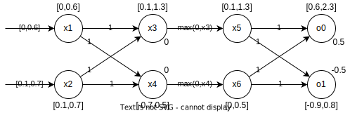
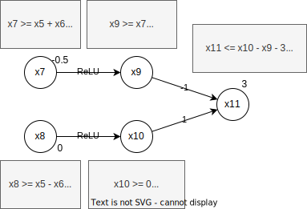
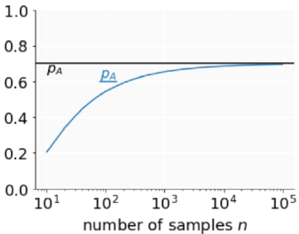

# Robustness

AIs have typically issues where they make false classifications due modified inputs. Such modifications can happen on
data directly, or on the data that is being captured. All in all, it gets more and more important to have AIs that
have a certain level of certified robustness giving some securities to the user. This is especially important for
security-relevant applications.

However, it is generally hard to certify models. And often, certification and improved robustness come with a certain
cost regarding the model's performance, especially if those certifications are required to be scalable.

## Attacks

AI models have generally weaknesses and can be fooled by attackers. Adding a small amount of noise to an image can
for example lead an image recognition model to wrong conclusions, or adding tape at certain spots on a stop sign can
lead models to recognise it as a different sign.

### Adversarial attacks

In adversarial attacks, we generally view two types of attacks:

- **Targeted Attack** where the attacker aims to classify the input as a **specific label** which differs from the
  correct label.
- **Untargeted Attack** where the aim is to classify the input as some label that is not the correct one.

The attacks can be further split into **white box** attacks where the attacker knows the complete model including
parameters and the architecture, and **black box** attacks where the attacker only knows the architectures but has no
information about the parameters.

The following chapters only discuss white box attacks. Below table describes the three attacks in brief.

| Attack type                 | Region                                            | Optimization                                                   | Outcome                                                                            |
|-----------------------------|---------------------------------------------------|----------------------------------------------------------------|------------------------------------------------------------------------------------|
| FGSM (targeted, untargeted) | $[-\epsilon, +\epsilon]$                          | One step of size $\epsilon$                                    | Output will be on region boundary                                                  |
| PGD (mostly untargeted)     | Any region for which projections exist            | Many steps, uses projections to stay inside the region         | Inside region with maximised loss                                                  |
| Carlini (targeted)          | Image and input + $\eta$ must be in range $[0,1]$ | Produce change $\eta$ with small $l_\infty$, taking many steps | Image inside $[0,1]$ with (hopefully) small $_\infty$ distance from original image |

#### Fast Gradient Sign Method (FGSM)

This attack uses the gradient descent of the classification model. The loss function of the gradient descent is
computed, and the added/removed from the input to form a modified output that should be classified with some other
label. The loss function is, however, modified before being added/removed: only the sign of the values is looked at,
not the exact value. This lead to better results than taking the gradient itself.

First, the perturbation is computed. This is slightly different for the targeted (T) and untargeted (U) mode. In T, the
loss function is computed for the target label **3**, whereas in U, the original label **s** is used.

$$
\eta_{t/s} = \epsilon \cdot sign(\nabla_xloss_{t/s}(x))
$$

where $\epsilon$ a small value indicating how large the perturbation should be, and $sign(g)$ returning -1 if $g < 0$, 0
if $g = 0$, or 1 if $g > 0$.

As the output of the loss function is passed through the sign function, and then multiplied by $\epsilon$, the output is
guaranteed to stay in the range $x \pm \epsilon$. The original paper had a single iteration of this algorithm. If the
perturbation did not change the output, the next input was looked at. The algorithm is designed to be fast and simple.

- **Targeted**: $x' = x-\eta_t$ modifies the input by **minimising the loss** for the label $t$.
- **Untargeted**: $x' = x+\eta_s$ modifies the input by **maximising the loss** for the original label $s$.

#### Carlini attack

In this attack, we are trying to find a perturbation $\eta$ classifies an input $x \in X$ to a target label $t \in C$:
$f(x + \eta) = t$ where $||\eta||_p$ is minimized. We thus have an optimization problem. We also require that $x+\eta$
stays in the domain of the problem ($[0,1]$ for images).

The optimization problem has currently a **hard discrete constraint** ($f(x + \eta) = t$). However, it is hard to find
the gradient to such problems. We thus require a relaxation. The Carlini attack uses a relaxation through an objective
(proxy/soft) function $obj_t$ such that

$$
\mathsf{if} \; obj_t(x + \eta) \leq 0 \; \mathsf{then} (x + \eta) = t
$$

Using this function, we are now trying to minimize $||\eta||_p + c \cdot obj_t(x + \eta)$. Notice that we are talking
about an **if** relation and not an **iff**.

The paper[^1] cites a series of soft functions. One highlighted in the course is

[^1]: [Carlini et al., Towards Evaluating the Robustness of Neural Networks](https://arxiv.org/abs/1608.04644)

$$
obj_t(x) = loss_t(x) -1 = -log_2(p_f(x)_t)-1
$$

where $p_f(x)_t$ is the probability of a class $t$ for some input $x$ on network $f$. The cross entropy loss is used as
a loss function. We now have a problem that can be optimized.

The model additionally has a **hard box constraint** to make sure that the output stays inside the domain of the input.
This is often solved through PGD (projected gradient descent).

Compare to the **FGSM**, this attack gets most often less perturbed attacks.

#### PGD

The **projected gradient descent** (PGD) can be seen as a series of FGSM attacks.

1. We start by picking some point $x_{orig}$ from the dataset and put an $l_\infty$ ball around it, with some $\epsilon$
   that is typically bigger than the one used in an FGSM attack.
2. Next, we select some random point $x$ in the box.
3. Now starts the PGD iteration. We compute $x' = x + \epsilon' \cdot sign(\nabla_xLoss(x))$. This is essentially an
   FGSM attack on $x$. $\epsilon'$ is smaller than $\epsilon$.
4. $x'$ might be outside the box around $x_{orig}$. We thus must project it back on the box $x'' = project(x',x_{orig},
   \epsilon)$. The projection uses clipping to get back into the box.
5. If $x''$ is not yet a labeled with a different class, we re-assign $x = x''$ and repeat from step 3 until we find
   another label.

Above algorithm is often run with a constant number of iterations. After that, either an adversarial example has been
found, or we simply look at the next sample $x$.

### Adversarial defenses

To defend somewhat against such attacks, we can use the following approach. For all samples $x$ we search for the point
in a region (eg. $l_\infty$) around $x$ that maximizes the loss. We then train the model on these points to minimize
the loss.

Although this might improve the adversarial accuracy, it typically reduces the standard accuracy.

An approach shown in the lecture (PGD-defense) uses a PGD-attack on a mini-batch of the dataset. The output of this
attack is then used in the training. The attack gives us samples with a maximized loss inside a region around the
original samples.

### Adversarial accuracy

The adversarial accuracy measures how well a model is holding against attacks in the $l_p$-ball for a specific
$\epsilon$. It is a metric for the robustness of a network.

Typically, a PGD attack is used to measure this metric. It takes all samples that were classified correctly, and tries
to break them. Let's say we have 100 samples out of which 95 are classified correctly (accuracy: 95%). Now, for 15
samples we found an adversarial example. The **adversarial accuracy** will thus be 80/100 = 80%.

## Certification

Until now, we have looked at attacks and defenses that might or might not work well in practice. However, there are no
formal guarantees. This is what we try to establish in this chapter: prove properties of realistic networks using
**automated verifiers**. More formally we can state our fundamental problem, given a neural network $N$, a property over
inputs $\phi$ (pre-conditions), and a property over outputs $\psi$ (post conditions):

**Prove that $\forall i \in I. \models \phi \Rightarrow N(i) \models \psi$ holds or return a violation**.

We can now instantiate this problem definition for an image classification neural network in the following steps.

1. **Define $\phi$**: to prove adversarial robustness, we define $\phi$ as the $l_\infty$-ball around an input $x$:
   $ball(x)_\epsilon = \{x' \in I \mid ||x-x'||_\infty < \epsilon \}$.
2. **Verify $\psi$ satisfies $\phi$**. We define the property $\phi$ as: We want to prove that all inputs inside the
   ball around $x$ are classified identically to $x$.

The challenge of this approach is, that we cannot simply prove the property for all points in the $l_\infty$-ball as
there are too many of them.

Before continuing, we must look at some properties of certification methods:

- **Sound vs. Unsound**: A method is called _sound_ when it states "property holds" iff the property truly holds. It is
  called _unsound_, if it states "property holds" even though this is not true.
- **Complete vs. Incomplete**: A method is called _complete_ if it is able to prove all cases where a property holds. It
  is called _incomplete_, if it misses some such cases.

It is difficult to have such an algorithm. Actually, having a sound and complete algorithm is only possible in
restricted types of computation, generally on small scaled networks.

This chapter covers two kinds of sound methods:

- Scalable but incomplete: Box relaxation, DeepPoly relaxation
- Not scalable but complete: MILP, Branch and Bound with Lagrange Multipliers and DeepPoly

### Incomplete certifications

The incomplete certification processes are generally faster, but are only able to approximate the results. They are
sound but incomplete. We start with initial preconditions $\phi$ and pushes them through the network. This leads to
over-approximations that different methods try to reduce to improve the certification. In essence, we have a certain
input region (in the case of an image, this can be represented with the image itself and a delta on each pixel), and we
try to prove for every point in this region, that the classification leads to the same result $\psi$. This is called
**bounds propagation**.

Every layer of the network to be certified produces a convex approximation, every layer loses some precision due to the
over-approximation. To make those approximations, two questions are to be answered.

- What convex approximations are used (box, zonotope, polyhedra, ...) ?
- How does a layer modify the convex approximation, often called **abstract transformer**?

In general, there is a trade-off to be made between approximation quality and speed.

#### Box relaxation

This first relaxation is very simple (thus fast), but loses quite a lot of precision. We use the convex approximation
**box**.

!!! tip "Abstract Transformers"

    The following transformers are used to propagate the approximations through a network. $\#$ denotes the transformer
    operation. $a,b,c,d \in \mathbb{R}^n$ are the approximation bounds where $\forall i, a_i \leq b_i$. 
    
    - Addition: $[a,b] +^{\#} [c,d] = [a+c, b+d]$ 
    - Negation: $-^{\#} = [-b,-a]$
    - ReLU:  $ReLU^{\#}[a,b] = [ReLU(a), ReLU(b)]$
    - Multiplication by positive constant: $\lambda^{\#}[a,b] = [\lambda \cdot a, \lambda \cdot b]$

As an example, we define two inputs $x_1=[0,0.3]$ and $x_2=[0.1,0.4]$. Our neural net defines the following
dependencies: $x_3 = x_1 + x_2$ and $x_4=x_1-x_2$. By applying above transformers, we obtain approximated intervals
$x_3 = [0.1, 0.7]$ and $x_4 = [-0.4, 0.2]$. In this case, the two intervals are overlapping. The classification might
therefore not be able to make the correct distinction on every input in the input range. However, the approximations
made by the box relaxation include also many points that are not achievable by the input regions - **the method is not
precise**.

One possibility to improve the precision somewhat is **merging the outputs**, and no longer requiring that the intervals
don't overlap, but that one's lower bound minus the other's upper bound is strictly greater than 0:

\begin{align}
x_3 - x_4 &> 0\\
x_1 + x_2 - (x_1 - x_2) &> 0\\
2x_2 &> 0
\end{align}

As we know that $x_2 > 0$, we are able to prove the property.

#### DeepPoly relaxation

The box relaxation seen in the previous chapter is lossy, it loses much precision both on ReLU and
affine abstract transformers. DeepPoly improves on this by eliminating loss on affine transformers, and reducing loss on
ReLU transformers.

Using the box relaxation we defined intervals of possible values for each neuron. For each following neuron, the
intervals are combined leading to imprecise results. DeepPoly also works with intervals, but keeps in mind the relation
of the different neurons. Upon combining layers, we can apply back substitution of those relations which leads to
simplifications in the relations and improve the respective precisions.

Let's look for example at the following affine layers. For both $x_1$ and $x_2$, we have an input interval of $[-1;1]$.
In addition of defining these intervals for each neuron of the first layer, we also compute the lower and upper bound
$l_1, u_1$. We do the same thing for the second layer but this time we define the intervals using the previous layer's
neurons. The lower and upper bounds are computed through back propagation of above intervals.

<figure markdown>

</figure>

For instance, nothing of interest has happened, our intervals are identical to the ones computed through the box
relaxation. Let's look now at a DeepPoly relaxation for a **ReLU** function. We must consider three separate cases based
on the lower and upper bounds observed at the neuron's input. We consider the ReLU $x_j = max(0, x_i)$, where $x_j$ is
our ReLU neuron and $x_i$ is the input.

- $l_i \geq 0$: strictly positive $a_j^\leq = a_j^\geq = x_i, l_j = l_i, u_j = u_i$
- $u_i \leq 0$: strictly negative $a_j^\leq = a_j^\geq = x_i, l_j = u_j = 0$
- $l_i < 0$ and $u_i > 0$: crossing ReLU, special relaxation applies

As illustrated in above case distinction, the relaxation is trivial for strictly negative and strictly positive
input intervals. However, the crossing ReLU, where the interval includes both negative and positive values is more
complicated. We discuss three possible relaxations.

!!! info "Relaxation constraints"

    === "Relaxation I"
        For the first relaxation we limit the values to the inside of below triangle. The triangle's sides are defined as
        follows: 
        
        - Lower $y$ bound: $y = 0$
        - Upper $y$ bound: $y = \gamma * (x - x_l)$ with a slope of $\gamma = \frac{u_x}{u_x - l_x}$
        - Right $x$ bound: $x = u_x$. 

        Note that the point $d$ is at 
        
        <figure markdown>
        
        </figure>
        
        Above line definitions can be translated into the following constraints: 
        
        - $y \geq 0$
        - $y \leq \gamma * (x - x_l)$
        - $x \leq x_u$

    === "Relaxation II"

        Let's get directly to the constraints. We keep the upper y limit identical to the previous relaxation. The lower
        bound is now defined as the slope of $x$.

        - Lower $y$ bound: $y \geq x$
        - Upper $y$ bound: $y \leq \gamma * (x - x_l)$ with a slope of $\gamma = \frac{u_x}{u_x - l_x}$
        - Lower $x$ bound: $x \geq l_x$ 

        <figure markdown>
        
        </figure>

    === "$\alpha$-relaxation"

        The $\alpha$-relaxation keeps some room for optimisation. The upper y limit is again identical. However, the 
        lower bound can be optimised through its slope to get the area of the shape as small as possible while staying
        inside the interval $\alpha = [0,1]$.

        - Lower $y$ bound: $y \geq \alpha x, \alpha \in [0,1]$
        - Upper $y$ bound: $y \leq \gamma * (x - x_l)$ with a slope of $\gamma = \frac{u_x}{u_x - l_x}$
        - Lower $x$ bound: $x \geq l_x$ 
        - Upper $x$ bound: $x \leq l_x$ 

        <figure markdown>
        
        </figure>

We can now apply one of the relaxations to neurons. We extend the network above with two new neurons applying
a ReLU on the outputs of $x_3$ and $x_4$.

<figure markdown>

</figure>

Now, we can stitch those neurons together with the affine layer, and add an output layer to analyse the system.
Without any further modification, this leads to the following network with output bounds $l_7 = -0.5$ and $u_7 = 3.5$.

<figure markdown>

</figure>

We can further improve those bounds by using back substitution. This is where DeepPoly improves over other methods. The
improved bound can, in this example, be observed with the upper bound $u_7$.

$$
\begin{align*}
x_7 &\leq x_5 + x_6 - 0.5\\
&= 0.5 x_3 + 1 + 0.5 x_4 + 1\\
&= 0.5(x_3 + x_4) + 1.5\\
&= 0.5(x_1+x_2+x_1-x_2) + 1.5\\
&= x_1 + 1.5\\
&= 2.5\\
x_7 &\leq 2.5
\end{align*}
$$

We observe that the upper bound has been improved from $3.5$ to $2.5$.

### Complete Certifications

The following chapters discuss complete certification methods. Such methods are interesting in theory, but not widely in
use due to their poor scalability.

#### MILP (Mixed Integer Linear Program)

The MILP solver is a complete certification method for ReLU networks. Unfortunately, the solver is at least
_NP-complete_, and is thus slow. We will also see the use of box bounds to make the solver somewhat faster without
losing the completeness.

Essentially, we convert a decision problem into an optimization problem. We start with some minimization objective

$$
\text{min}c_1x_1 + c_2x_2 + ... + c_nx_n
$$

with $c_i \in \mathbb{R}$, and $x_j$ integer or real (hence "mixed integer"). The objective is subject to some linear
constraints

\begin{align}
a_{11}x_1 + ... + a_{1n}x_n \leq $b_1\\
...\\
a_{m1}x_1 + ... + a_{mn}x_n \leq $b_1
\end{align}

with $a_{ij}, b_i \in \mathbb{R}$. Lastly, bounds are defined on every neuron to improve MILP's performance.

$$
l_i \leq x_i \leq u_i \quad 1 \leq i \leq n
$$

With these definitions out of the way, the network must be encoded as a MILP instance in four steps:

1. Encode Affine layer
2. Encode ReLU layer
3. Encode pre-condition $\phi$
4. Encode post-condition $\psi$

Encoding **affine layers** is trivial, as this is just a linear constraint. The same is valid for convolutions, as these
are essentially affine transformations. $y = Wx + b$, where $W$ are the weights and $b$ is the bias.

The **ReLU layer** is the reason that MILP is slow. We assume that the lower and upper bounds are known for the previous
layer. The encoding is defined as follows.

\begin{align}
y &\leq x - l \cdot (1-a)\\
y &\geq x\\
y &\leq u \cdot a\\
y &\geq 0\\
a &\in \{0,1\}
\end{align}

The encoding introduces the **branching variable** $a$ for each crossing ReLU (that is, $l < 0$ and $u > 0$). In the
worst case, this branching must be done for every ReLU, leading to an exponential complexity. The box bounds computation
is used here to check which ReLUs are crossing. This allows the reduction of branching.

??? info "Elaboration on the branching variable"

    For $a= 0$ (notice that the last two inequalities result in $y=0$):
    
    - $y \leq x-l$
    - $y \geq x$
    - $y \leq 0$
    - $y \geq 0$
    
    For $a=1$ (notice that the first two inequalities result in $y=x$):
    
    - $y \leq x$
    - $y \geq x$
    - $y \leq u$
    - $y \geq 0$

As a **pre-condition**, we take $\phi = L_{\infty}$ around $x$ as an example. This is encoded as $x_i - \epsilon \leq
x_i' \leq x_i + \epsilon$, introducing bounds for each input neuron $x_i'$.

The **post-condition** $\psi$ defines that one label is always more probable than the other labels, no matter the input
from $\phi$: for two inputs, we say: $\psi = o_0 > o_1$ - this is what the MILP tries to prove, and we must thus form
the objective around this post-condition. The encoding is defined as $\text{min}(o_0 - o_1)$.

With the above encodings, we can define the MILP instance as follows:

- **Minimization objective**: $\min(o_0 - o_1)$
- **Linear constraints**: Afine and ReLU encodings
- **Bounds**: Bounds per neuron $l_i \leq x_i^p \leq u_i$, bounds on input $x_i - \epsilon \leq x_i' \leq x_i +
  \epsilon$
- **Mixed integer**: $a_j \in \{0,1\}$

??? tip "Example"

    Let's consider the following network with bounds computed through the box relaxation.
    
    <figure markdown>
    
    </figure>
    
    With this network, we can define the following instance. 
    
    - Affine:
        - $x_3 = x_1 + x_2$
        - $x_4 = x_1 - x_2$
        - $o_0 = x_5 + x_6 + 0.5$
        - $o_1 = x_5 - x_6 - 0.5$
    - ReLU
        - $x_5: x_3 \leq x_5 \leq x_3 - 0.1 \cdot (1-a_5)$
        - $x_5: 0 \leq x_5 \leq 1.3 \cdot a_5$
        - $x_6: x_4 \leq x_6 \leq x_4 + 0.7 * (1-a_6)$
        - $x_6: 0 \leq x_6 \leq 0.5 \cdot a_6$
    - Input bounds: 
        - $0\leq x_1 \leq 0.6$
        - $0.1 \leq x_2 \leq 0.7$
    - Box bounds:
        - $0.1 \leq x_3 \leq 1.3$
        - $-0.7 \leq x_4 \leq 0.5$
        - $0.1 \leq x_5 \leq 1.3$
        - $0 \leq x_6 \leq 0.5$
    - Binary integer variables: $a_5,a_6 \in \{0,1\}$

    Using the box bounds, we can see directly that the input on $x_5$ is strictly positive. This leads to the first 
    condition being infeasible for $a_5=0$, as this would lead to $x_3 \leq x_5 \leq x_3 - 0.1$, which is impossible.

    Now, the only branching variable remaining is $a_6$. We must thus prove the property for both its possible values.

    - $a_6 = 0:$
        - $x_6 = 0$
        - $o_0 - o_1 = 2 \cdot x_6 + 1 = 1$
    - $a_6 = 1:$
        - $x_6 = x_4, 0 \leq x_6 \leq 0.5$
        - $o_0 - o_1 = 2 \cdot x_6 + 1$
        - $1 \leq o_0 - o_1 \leq 2$

#### DiffPoly

DiffPoly is an extension to DeepPoly and acts on the ReLU approximations. Instead of having an area, DiffPoly tries to
not lose any precision by enforcing constraints on the input while staying differentiable. Our verification problem
becomes an optimization problem.

We are trying to get the split $x=0$ and $x=x$, but with the additional constraint $x=0 \mid x \leq 0$, $x=x \mid x >
0$. This constraint is enforced through a **KTT condition**.

??? info "KKT condition"

    We have our splitting constraint $g(x)$. If this gets greater than 0, the function $f(x) - \beta g(x)$ gets to 
    negative infinity for a growing $\beta$, thus incentivising the choice of a different $x$. Concretely, this computes
    an upper bound. To compute a lower bound, it is sufficient to swap $\min$ with $\max$ and vice versa. 
    
    $$
    \max_{x\in \mathcal{X}} f(x) \leq \max_{x\in \mathcal{X}} \min_{\beta \geq 0} f(x) - \beta g(x)
    $$
    
    $$
    s.t. \quad g(x) \leq 0
    $$

    Applied on our splitting problem, this gets converted into: 

    $$
    \max_{x \in \mathcal{X}} ax + c \leq \max_{x\in \mathcal{X}} \min_{\beta \geq 0} ax + c + \beta x_i
    $$
    
    $$
    s.t. \quad -x_i \leq 0
    $$
    
    As an example, we receive here a maximisation problem for an output variable ($ax = \text{output}$, $c=\text{bias}$),
    making it dependent on some ReLU node ($x_i$ is this ReLU node) via a lagrange multiplier.

In the example, we will use the network shown below. To begin, the shown bounds and coefficients are computed using
DeepPoly.

<figure markdown>

</figure>

In the process of backsubstitution, we must always consider the value of $\beta$, because if the sign of $a\beta + b$
is negative, the lower bounds of the substituted values must be used (when computing the upper bounds of the output).
The below case distinctions are more symbolic, they all happen in the optimization automatically.

=== "$0.5 \leq \beta \leq 1.5$"

    \begin{align}
    &\max_xx_{11} (s.t. \; x_7 > 0)\\
    &\leq \max_x x_{10}-x_9+3 (s.t. \; x_7 > 0)\\
    &\leq \max_x 0.5x_8 -x_7 + 4 (s.t. \; x_7 > 0)\\
    &\leq \max_x \min_{\beta \geq 0} 0.5x_8-x_7 + 4 + \beta x_7\\
    &\leq \max_x \min_{\beta \geq 0} (\beta - 0.5)x_5 + (\beta - 1.5) x_6 + 4.5 + 0.5\beta \\
    &\leq \max_x \min_{\beta \geq 0} (0.5\beta - 0.25)x_3+ 4.5 + \beta\\
    &\leq \max_x \min_{\beta \geq 0} (0.5\beta-0.25)(x_1+x_2) + 4 + 0.5 \beta\\
    &= 4.25
    \end{align}

=== "$\beta \leq 0.5$"

    \begin{align}
    &...\\
    &\leq \max_x \min_{\beta \geq 0} (\beta - 0.5)x_5 + (\beta - 1.5) x_6 + 4.5 + 0.5\beta \\
    &\leq \max_x \min_{\beta \geq 0} 4.5 - 0.5 \beta\\
    &= 4.25
    \end{align}

=== "$1.5 \leq \beta$"

    \begin{align}
    &...\\
    &\leq \max_x \min_{\beta \geq 0} (\beta - 0.5)x_5 + (\beta - 1.5) x_6 + 4.5 + 0.5\beta \\
    &\leq \max_x \min_{\beta \geq 0} (\beta - 0.25)x_3 + (\beta - 0.75) x_2 2.5 + 1.5\beta \\
    &\leq \max_x \min_{\beta \geq 0} (\beta - 1)x_1 + 0.5x_2 2.5 + 1.5\beta \\
    &\leq \max_x \min_{\beta \geq 0} 2 + 2.5\beta\\
    &= 5.75
    \end{align}

We have now a system that can be optimised (with some modification, see below) on $\beta$.

\begin{align}
&\max_x \min_{\beta \geq 0} (0.5\beta-0.25)(x_1+x_2) + 4 + 0.5 \beta\\
\leq &\min_{\beta \geq 0}\max_x (0.5\beta-0.25)(x_1+x_2) + 4 + 0.5 \beta\\
\leq &\min_{\beta \geq 0} \beta-0.5 + 4 + 0.5 \beta = \min_{\beta \geq 0} 3.5 + 1.5\beta
\end{align}

From (1) to (2), we apply the "weak duality". From (2) to (3), we simply insert the lower/upper bounds.

In above calculations, we set $l_7=0,u_7=2.5$ to have the positive split. The same must now be done for
the negative split with $l_7=-0.5, u_7=0$. The maximum of the two optimization problems is the final solution.

DiffPoly is generally implemented using a queue that is initialized with the full verification problem. The probelm is
then tried to be verified. If not successful, some crossing ReLU is taken, and a split is created. Both new subproblems
are then added to the queue. This continues until no more unverified problems are in the queue (or a timeout occurs, in
which case the property is not verified).

### Certified defense

Until now, the relaxations and proving methods were only applied on a trained network. To obtain more provable networks,
the relaxations can actually be incorporated during training. Even though, the accuracy is reduced, and the network is
harder to optimize, we gain in verifiability. Actually, we try to bias the training process of a network for the
properties we care about to be more provable.

Incorporating provability into the training process is somewhat similar to PGD defense. We search for $\theta$ (network
parameters) that minimizes $\rho(\theta)$ where

$$
\rho(\theta) = E_{(x,y)\sim D} [\max_{z \in \gamma(NN^{\#}(S(x)))} \quad L(\Theta, z, y)]
$$

In other words, we pass our sample $x$ and its region around it $S(x)$ through some relaxation $NN^{\#}$ (e.g.
DeepPoly), and find $z$ in the relaxed output shape achieving the highest loss (contrary to the PGD attack where we
searched for a point in the input region with the highest loss).

The loss can be computed through some loss function $L(z, y) = \max_{q \neq y}(z_q - z_y)$ where $z$ is a vector of 
logits. Now, every point in the output shape of $NN^{\#}$ might be the possible max. But as there are too many of them, 
we must do approximations. This approximation can be done for example through an additional DeepPoly layer computing 
$d_q = z_q - z_y$ which is exact giving us lower and upper bounds for all of them. We can now compute the max over these
bounds $d_q$. 

For instance, this network does not prove anything, it just tries to make it more provable. For this reason, the 
forward pass through $NN^{\#}$ does not need to be sound. We can use subregions of $S(x)$, or remove some intermediate
ReLU's to reduce the size of the relaxation shape. This allows for faster optimization.  

Counter-intuitively, using more precise relaxations on the input mostly leads to worse outputs. This is due to the
complexity of the abstractions, rendering the problem harder to optimize.  

## Randomized smoothing

Contrary to the prior techniques that were deterministic, we now look at a randomized approach. We create a classifier
that is robuts by construction.

Given a classifier $f$, we construct a smoothed classifier that finds the most probable class given some noise $\epsilon$
that follows an isotropic gaussian noise.

$$
g(x) := \text{argmax}_c\in\mathcal{y} \quad \mathbb{P}_{\epsilon}(f(x+\epsilon) = c)
$$

The classifier $g$ can tell us thus the probability for each class given the perturbation, and most importantly the most
probable class. Now, using above definition, we can compute a lower bound probability for the most probable class
$\underline{p_{A,x}}$ and an upper bound for the next most probable class $B$ (runner-up) $\overline{p_{B,x}}$. Very
important: all those computations are for one very specific input $x$.

This allows as to get a certification

$$
g(x + \delta) = c_A \quad \forall || \delta||_2 < R_x
$$

$$
R_x := \frac{\sigma}{2}(\Phi^{-1}(\underline{p_{A,x}})- \Phi{^-1}(\overline{p_{B,x}})
$$

with $\Phi^{-1}$ the inverse of the standard Gaussian CDF.

To increase the radius, we try to maximize $\sigma$ - the noise added to the input. However, the value must not get too
big as this will break the classification algorithm.

The hard part is the computation of the probabilities $p_{A,x}$ and $p_{B,x}$ efficiently and soundly. In a first step, we change
the formula for radius computation such that it is only depending on $p_{A,x}$:

\begin{align}
R_x := \frac{\sigma}{2}(\Phi^{-1}(\underline{p_{A,x}})- \Phi{^-1}(\underline{p_{B,x}}) &\geq
\frac{\sigma}{2}(\Phi^{-1}(\underline{p_{A,x}})- \Phi{^-1}(\underline{1-p_{A,x}})\\
&= \frac{\sigma}{2}(\Phi^{-1}(\underline{p_{A,x}}) + \Phi{^-1}(\underline{p_{A,x}})\\
&= \sigma \Phi^{-1}(\underline{p_{A,x}})
\end{align}

### Certification procedure

The following procedure roughly outlines how the certification is done.

```
function CERTIFY(f, sigma, x, n0, n, alpha):
   ca = guess_top_class(f, sigma, x, n0)
   pa = lower_bound_prob(ca, f, sigma, x, n, alpha)

   if pa > 0.5:
      R = sigma * phi_inv(pa)
      return ca, R
   else:
      return ABSTAIN // pa too low, lower bound of pa is too low,
                     // or we estimated wrong pa
```

To compute the lower bound probability, we get help by the **Monte Carlo Integration**, as otherwise the integral would
be too hard. The Monte Carlo Integration essentially samples many points and computes the final probability based on how
often the sample was classified as $c_A$.

$$
p_A(x) \approx \frac{1}{n} \Sigma^n_{i=1}[f(x + \epsilon_i) = c_A] = \widehat{p_A}
$$

Now, we need to get a statistical bound for this $\widehat{p_A}$, as we don't know if its value is bigger or smaller than the
true $p_A$. This can be done using a **binomial confidence bound**. Essentially, the above sum expects a binomial
distribution. We can define probability bounds for an error rate $\alpha$ as $\mathbb{P}(\underline{p_{A,x}} \leq p_{A,x} \leq
\overline{p_{A,x}}) \leq 1 - \alpha$. Increasing $\alpha$ means allowing more errors, and thus the lower bound will get closer
to the true probability.

<figure markdown>

</figure>

### Inference procedure

Using this model we can now compute the class that would be predicted by $g(x)$.

```
function PREDICT(f, sigma, x, n, alpha):
   // take n samples and compute monte carlo probability
   ca, na, cb, nb = top_two_classes(f, sigma, x, n)

   // compute the p-value, that na and nb are equally probable
   if BinomPValue(na, na + nb, =, 0.5) <= alpha:
      return ca
   else:
      return ABSTAIN
```

### Deterministic vs Randomized

|                                | Robustness Certificate | Adaption to new model class | Adaption to new specification        | Suitable for NN scale                             |
|--------------------------------|------------------------|-----------------------------|--------------------------------------|---------------------------------------------------|
| **Deterministic Verification** | Through sound analysis | Requires new transformers   | Encode perturbation as convex region | small to mid size                                 |
| **Randomized Smoothing**       | By construction        | Model Agnostic              | Requires new mathematical insights   | All sizes, but added latency might be prohibitive |